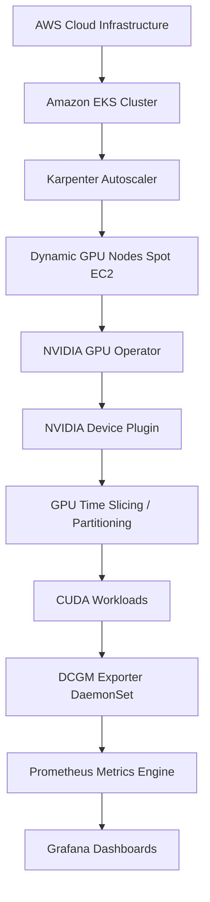

# GPU Platform on Amazon EKS: AI Infrastructure Blueprint

[](https://kubernetes.io/)
[](https://www.terraform.io/)
[](https://github.com/NVIDIA/gpu-operator)
[](https://karpenter.sh/)
[](https://argoproj.github.io/argo-cd/)

A production-grade, GitOps-driven Kubernetes platform architecture tailored for the provisioning, scaling, and observability of NVIDIA GPU workloads on Amazon EKS. This repository showcases real-world platform engineering patterns to dynamically manage heterogeneous GPU hardware, partition compute resources via Time Slicing, execute CUDA validation suites, and expose low-level hardware telemetry.

---

## Architecture Flow

The platform is designed in a layered architecture, starting from bare AWS infrastructure and flowing down to user-facing ML workloads and observability dashboards:



For a deep dive into the runtime bootstrap process and communication flow between these components, see [docs/architecture.md](file:///Users/karthik.orugonda/github/ai-infrastructure-on-eks/docs/architecture.md).

---

## Key Features

*   **Dynamic GPU Node Provisioning:** Leverages Karpenter to spin up specialized AWS EC2 GPU instances (`g4dn.xlarge`, `g4dn.2xlarge`, `g6.xlarge`) on-demand based on workload requests, automatically selecting cost-efficient Spot capacity and enforcing hard resource bounds.
*   **Automated GPU Lifecycle Management:** Deploys the NVIDIA GPU Operator to boot and supervise the driver kernel modules, container toolkit, device plugin, and validators automatically on newly provisioned GPU nodes.
*   **Resource Partitioning (GPU Time-Slicing):** Implements system-level GPU virtualization to advertise multiple virtual GPU devices per physical GPU, allowing small inference or utility workloads to share physical VRAM and compute safely.
*   **Hardware Observability & Telemetry:** Runs NVIDIA DCGM (Data Center GPU Manager) Exporter to extract low-level metrics (VRAM usage, SM clock speed, temperature, PCIe throughput, energy consumption) and scrapes them into a local Prometheus/Grafana stack.
*   **GitOps-Driven Configuration Management:** Employs Argo CD to manage the state of cluster components (Karpenter NodePools, EC2NodeClasses, Prometheus deployments, and application manifests) directly from the repository.

---

## Directory Layout

```text
gpu-platform-on-eks/
├── README.md                  # Project overview, layout, and portfolio features
├── Makefile                   # Automation entrypoint for Terraform and Kubernetes configurations
├── AGENTS.md                  # Development constraints and workflow guidelines
├── 01-infrastructure/         # Terraform configurations for VPC network and EKS control plane
│   ├── 01-network/            # Base VPC, public/private subnets, NAT Gateway
│   ├── 02-eks/                # EKS cluster, node groups, IAM roles, and Karpenter credentials
│   ├── main.tf                # Infrastructure orchestration
│   ├── providers.tf           # Terraform AWS and Helm provider configuration
│   └── variables.tf           # Infrastructure variables
├── 02-platform/               # Kubernetes platform controllers and custom resource configurations
│   ├── argocd/                # Deployed Helm configurations for Argo CD
│   ├── karpenter/             # NodePool and EC2NodeClass YAML specifications
│   ├── monitoring/            # Prometheus and Grafana service and deployment YAMLs
│   ├── main.tf                # Terraform orchestrations for platform controllers (Helm releases)
│   └── variables.tf           # Platform variable declarations
├── 03-workloads/              # CUDA and CPU verification workloads
│   ├── cpu-test-deployment.yaml
│   ├── gpu-test-deployment.yaml
│   ├── gpu-test-pod-workloads.yaml
│   └── argocd-app.yaml        # Argo CD application configuration
├── docs/                      # Technical documentation and guides
│   ├── architecture.md        # Technical component relationships and diagrams
│   ├── troubleshooting.md     # Production troubleshooting runbook
│   ├── hands-on-labs.md       # 15 step-by-step platform execution labs
│   └── interview-notes/       # Conceptual deep dives on GPU systems architecture
│       ├── device-plugin.md   # Kubelet device plugin contract (ListAndWatch/Allocate)
│       ├── gpu-operator.md    # GPU Operator components and ClusterPolicy
│       ├── time-slicing.md    # GPU virtualization (Time-Slicing, MIG, MPS)
│       ├── dcgm.md            # Hardware metrics collection and exporter mechanics
│       └── karpenter.md       # Karpenter scheduling, Spot provisioning, and disruption
└── archive/                   # Deprecated resources and scratch configurations
```

---

## Core Technologies

| Domain | Tools / Technologies |
|---|---|
| **Cloud Infrastructure** | AWS, VPC, IAM, EKS, KMS |
| **Infrastructure as Code** | Terraform, Make |
| **Compute Scheduling** | Kubernetes Scheduler, Karpenter Autoscaler |
| **GPU Execution Environment** | NVIDIA GPU Operator, Container Toolkit, CUDA |
| **GPU Scheduling & Sharing** | NVIDIA Device Plugin, GPU Time Slicing (Shared VRAM) |
| **Metrics & Observability** | NVIDIA DCGM Exporter, Prometheus, Grafana |
| **Configuration Delivery** | Argo CD (GitOps Core) |

---

## Deployment Workflow

```text
Step 1: Terraform Init & Plan   --> Executes tf validations inside 01-infrastructure/
Step 2: VPC Network Provision   --> Deploys highly-secure private subnets and NAT Gateways
Step 3: EKS Cluster Setup       --> Boots EKS control plane and initial system Node Group (T3 instances)
Step 4: Platform Bootstrap      --> Terraform installs Helm releases for Argo CD and Karpenter
Step 5: NodePool Configuration  --> Applies Karpenter NodePools to define target GPU EC2 Spot families
Step 6: Workload Deployment     --> Workloads target GPU resources, triggering Karpenter scale-up
Step 7: Operator Initialization --> GPU Operator configures newly booted nodes (Drivers, Device Plugin)
Step 8: Metric Collection       --> DCGM Exporter scrapes GPU stats; Grafana visualizes load
```

---

## Learning Outcomes

*   **Kubernetes Device Plugin Interface:** Mastered the structural contract between `kubelet` and the NVIDIA Device Plugin. Visualized how `Register()`, `ListAndWatch()`, and `Allocate()` lifecycle calls control resource tracking and container mounting.
*   **Kubelet Device Manager Internals:** Understood how Kubelet manages the host `/dev` socket, assigns local device paths, and configures container runtimes (NVIDIA Container Runtime) dynamically.
*   **Heterogeneous GPU Scheduling:** Configured Karpenter NodePools to match workloads requesting `nvidia.com/gpu` resources, targeting proper node taints and tolerations to isolate expensive compute.
*   **GPU Virtualization Tradeoffs:** Investigated multi-tenant GPU sharing strategies including GPU Time-Slicing, Multi-Instance GPU (MIG), and Multi-Process Service (MPS).
*   **Hardware Observability at Scale:** Configured Prometheus scrape jobs for the DCGM Exporter daemonset. Built custom Grafana dashboards focusing on critical infrastructure KPIs (e.g., SM occupancy, VRAM saturation, throttle reasons).

---

## Production Scenarios & Outages Investigated

This repository houses troubleshooting configurations representing real production failure modes encountered during cluster scaling and operator upgrades:

*   **NVIDIA Device Plugin CrashLoopBackOff:** Resolved conflicts where the Device Plugin crashed due to mismatched container runtime configurations or missing host-level driver links.
*   **Broken ClusterPolicy Reconciliation:** Debugged cases where the GPU Operator failed to reconcile driver or toolkit pods because of restrictive network policies, security context constraints, or missing kernel-headers on the host image.
*   **Invalid ConfigMap Time-Slicing Disruption:** Solved incidents where incorrect GPU replication keys in the config map caused nodes to advertise zero GPU resources, starving pending workloads.
*   **GPU Operators Failing to Advertise Capacity:** Investigated Kubelet failing to advertise `nvidia.com/gpu` resources due to Node Feature Discovery (NFD) labels missing from the node object.
*   **Karpenter Runaway Scaling (Unexpected GPU Nodes):** Fixed scheduling configurations where workloads lacking proper tolerations scheduled on GPU nodes, or workloads requesting GPUs without node selectors forced Karpenter to spin up expensive GPU instances instead of standard CPU instances.
*   **Node Becoming NotReady under Heavy CUDA Load:** Debugged hardware and driver crashes under high thermal/SM frequency load that triggered kernel panics, placing nodes into a `NotReady` status.

Detailed reproduction steps, inspection commands, root cause analyses, and permanent resolutions are cataloged in the [docs/troubleshooting.md](file:///Users/karthik.orugonda/github/ai-infrastructure-on-eks/docs/troubleshooting.md) runbook.

---

## Future Improvements

To expand this platform for LLM fine-tuning and inference pipelines, the following features are planned:
1.  **Multi-Instance GPU (MIG):** Configure physical A100/H100 partitioning at the hardware level for strict memory and compute isolation.
2.  **Volcano Scheduling:** Integrate Volcano scheduler for batch processing, gang scheduling, and queue management of distributed ML training runs.
3.  **Distributed Training Over NCCL:** Configure AWS EFA (Elastic Fabric Adapter) and GPUDirect RDMA inside the Kubernetes network to optimize multi-node training over NCCL.
4.  **Inference Pipelines (Triton / vLLM):** Deploy serving frameworks (vLLM and Triton Inference Server) managed by KServe for dynamic GPU autoscaling based on concurrent request counts.
5.  **Ray Cluster on EKS:** Setup KubeRay to manage distributed Python applications on Karpenter-provisioned GPU nodes.
