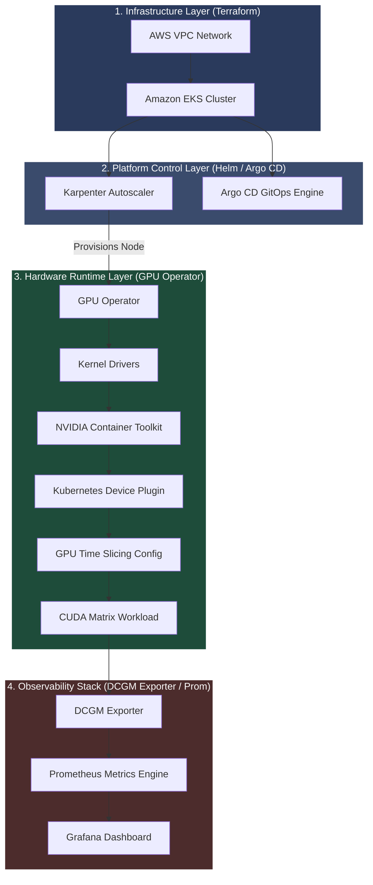

# AI Infrastructure Platform on Amazon EKS

[](https://kubernetes.io/)
[](https://www.terraform.io/)
[](https://github.com/NVIDIA/gpu-operator)
[](https://karpenter.sh/)
[](https://argoproj.github.io/argo-cd/)

A production-ready blueprint for an EKS-based AI Infrastructure Platform, optimized for provisioning, scaling, partitioning, and observing NVIDIA GPU workloads.

---

## Architecture Topology

The platform separates responsibilities into four distinct layers (Infrastructure, Platform, Runtime, and Observability):



*For detailed component relationships and structural breakdowns, see [docs/architecture.md](file:///Users/karthik.orugonda/github/ai-infrastructure-on-eks/docs/architecture.md).*

---

## What this platform demonstrates

*   **Provision GPU nodes dynamically** with Karpenter based on pending workload requirements.
*   **Deploy NVIDIA GPU Operator** using Helm to manage driver compile and loading lifecycles.
*   **Configure GPU Time Slicing** to share VRAM resources across multiple concurrent containers.
*   **Run CUDA workloads** on EKS using target taints to validate execution sandboxes.
*   **Observe GPU metrics** with DCGM Exporter, extracting hardware metrics on port 9400.
*   **Visualize GPU utilization** in Grafana using Prometheus metrics scrape channels.
*   **Investigate Kubernetes Device Plugin failures** and runtime recovery procedures under load.
*   **Troubleshoot GPU scheduling** bottlenecks and node lifecycle consolidation disruptions.

---

## Core Features

*   **Dynamic Autoscaling:** I configured Karpenter NodePools to match GPU-specific resource demands (`nvidia.com/gpu`), scaling out spot compute instances (`g4dn`, `g6` families) to minimize execution costs.
*   **Automated GPU Lifecycle:** Instantiated the GPU Operator to load kernel modules, configure the container runtime hook, and execute CUDA validators.
*   **Virtual GPU Partitioning:** Implemented GPU Time Slicing to divide physical GPUs into multiple virtual slices, enabling smaller workloads to share resources.
*   **Observability Pipeline:** Integrated DCGM Exporter with Prometheus and Grafana, capturing real-time SM execution and core temperatures.

---

## Repository Structure

```text
ai-infrastructure-on-eks/
├── 01-infrastructure/      # Terraform modules: VPC, subnets, EKS, and IAM OIDC roles
├── 02-platform/            # Platform bootstraps: Argo CD, Karpenter pools, monitoring
├── 03-workloads/           # CUDA execution validation deployments & GitOps manifests
├── docs/                   # Guides, runbooks, and deep-dive conceptual notes
│   ├── labs/               # 6 logical platform engineering hands-on labs
│   ├── interview-notes/    # Conceptual systems design interview guides
│   ├── architecture.md     # Sequence interactions & dependency flows
│   ├── troubleshooting.md  # Production troubleshooting runbook
│   ├── lessons-learned.md  # Engineering debugging journal & post-mortems
│   ├── performance.md      # GPU performance, metrics, and latency observations
│   └── roadmap.md          # Future enhancements (MIG, vLLM, Ray, Distributed Training)
└── Makefile                # Operations entrypoint for TF and Kubernetes automation
```

---

## Deployment & Demo Workflow

I verified the entire bootstrap and execution workflow using the following progressive stages:

1.  **Infrastructure Initialization:**
    ```bash
    make init && make validate
    ```
2.  **Cluster Provisioning:**
    ```bash
    make apply
    ```
3.  **Dynamic Scale-up Verification:**
    I scheduled a pending GPU job to trigger Karpenter node provisioning:
    ```bash
    kubectl apply -f 03-workloads/gpu-test-pod-workloads.yaml
    ```
4.  **Operator Lifecycle Check:**
    I verified the GPU Operator successfully loads driver layers:
    ```bash
    kubectl get pods -n gpu-operator -w
    ```
5.  **CUDA Computation Validation:**
    I verified core hardware execution:
    ```bash
    kubectl apply -f 03-workloads/gpu-test-deployment.yaml
    ```
6.  **Scrape Verification:**
    I queried metrics from the scrape engine:
    ```bash
    kubectl exec -n gpu-operator ds/nvidia-dcgm-exporter -- curl -s localhost:9400/metrics | grep DCGM_FI_DEV_GPU_UTIL
    ```

---

## Screenshots

The following visual checkpoints demonstrate the verified state of the platform:

### 1. Observability Dashboard
Displays high-resolution SM utility spikes, memory allocations, and thermal states:


### 2. GPU Time Slicing Architecture
Conceptual layout illustrating physical-to-virtual GPU resource partitioning:


### 3. Dynamic Provisioning
Karpenter controller logs capturing EKS dynamic scale-up requests:


### 4. GPU Hardware Status
Device verification output inside container namespaces using `nvidia-smi`:


---

## Engineering Investigations & Outcomes

*   **Validated** Kubelet-to-Device Plugin contracts, tracing `Register()`, `ListAndWatch()`, and `Allocate()` gRPC cycles.
*   **Investigated** multi-tenant sharing methodologies, evaluating VRAM limits under GPU Time Slicing, MIG, and MPS.
*   **Profiled** low-level metrics (`dcgm_sm_copy`, `dcgm_xid_errors`), implementing alert rules for hardware throttling and bus faults.
*   **Troubleshot** real-world failure patterns including container runtime loops, invalid config mapping boundaries, and Karpenter multi-resource scheduling bottlenecks.

---

## Documentation Registry

To explore specific topics, refer to the following resources:
*   **Hands-on Labs:** [01: Provisioning](docs/labs/01-gpu-node-provisioning.md) | [02: GPU Operator](docs/labs/02-gpu-operator.md) | [03: Device Plugin](docs/labs/03-device-plugin.md) | [04: Time-Slicing](docs/labs/04-time-slicing.md) | [05: Observability](docs/labs/05-dcgm-observability.md) | [06: Troubleshooting](docs/labs/06-production-troubleshooting.md)
*   **Systems Architecture Guides:** [Architecture Deep-Dive](docs/architecture.md) | [Performance Profiling](docs/performance.md) | [Future Roadmap](docs/roadmap.md)
*   **Interview Preparation Notes:** [Device Plugin Interface](docs/interview-notes/device-plugin.md) | [GPU Operator Internals](docs/interview-notes/gpu-operator.md) | [Virtualization Models](docs/interview-notes/time-slicing.md) | [Telemetry Metrics](docs/interview-notes/dcgm.md) | [Karpenter Scheduling](docs/interview-notes/karpenter.md)
*   **Incident Journal:** [Lessons Learned & Post-Mortems](docs/lessons-learned.md)
