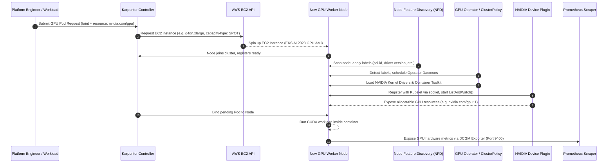
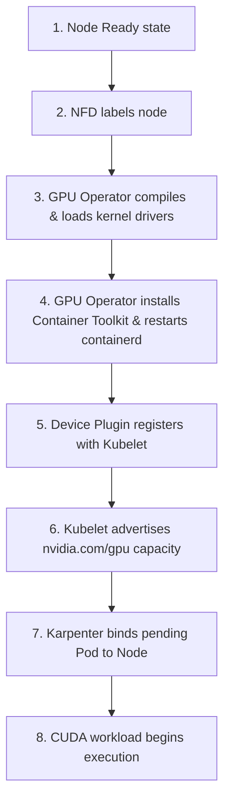

# Systems Architecture & Platform Runtime

This document details the systems architecture, lifecycle orchestration, and data paths of the GPU-optimized infrastructure running on Amazon EKS.

---

## Architecture Topology

The platform coordinates infrastructure provisioning, system daemon initialization, workload execution, and telemetry scrape streams across distinct layers:

---

## Core Component Registry

### 1. Karpenter (Just-in-Time Compute Autoscaler)
Unlike legacy Kubernetes Cluster Autoscaler (which scales AWS Auto Scaling Groups based on pending pods), Karpenter operates directly on the EKS control plane and bypasses ASGs.
*   **Mechanics:** It intercepts pending pods, evaluates their CPU, Memory, NodeSelector, and Toleration requirements, and calls the AWS EC2 fleet APIs directly to provision the exact instance size and capacity type (Spot vs On-Demand) required.
*   **GPU Optimizations:** Configured via `EC2NodeClass` and `NodePool` to target GPU-specific instances (e.g. G4dn, G6 families). It dynamically discovers EKS-optimized AMIs with pre-installed kernel configurations and injects custom taints (`nvidia.com/gpu=true:NoSchedule`) to isolate these expensive machines from regular CPU workloads.

### 2. Node Feature Discovery (NFD)
*   **Role:** NFD is a Kubernetes controller that runs as a DaemonSet to detect hardware features on the underlying cluster nodes (e.g., CPU features, PCI devices, system properties) and automatically publishes them as node labels.
*   **GPU Interaction:** NFD identifies the presence of physical NVIDIA PCI hardware IDs and writes labels such as `feature.node.kubernetes.io/pci-10de.present=true`. These labels act as the execution trigger for the NVIDIA GPU Operator.

### 3. NVIDIA GPU Operator
*   **Role:** An advanced custom controller that automates the installation and lifecycle management of all NVIDIA software components needed to execute GPU workloads.
*   **CRD Control (ClusterPolicy):** Managed through a single unified `ClusterPolicy` Custom Resource. The operator monitors this resource to deploy, update, and reconcile downstream daemonsets.
*   **Driver Manager:** Compiles and loads the necessary kernel modules (e.g., `nvidia.ko`, `nvidia-uvm.ko`) on the host operating system dynamically if they are not pre-baked into the node AMI.
*   **NVIDIA Container Toolkit:** Configures the underlying container runtime (e.g., `containerd`) to support the GPU execution layer, editing `config.toml` to register the `nvidia` runtime wrapper.

### 4. NVIDIA Device Plugin
*   **Role:** Operates as a DaemonSet to register physical GPU hardware resources with the local `kubelet` process.
*   **Lifecycle API Contract:**
    1.  **Register:** Connects to Kubelet's UNIX domain socket (`/var/lib/kubelet/device-plugins/kubelet.sock`) to announce its presence.
    2.  **ListAndWatch:** Establishes a gRPC stream with Kubelet to continuously report the health status and availability of all local GPU devices.
    3.  **Allocate:** Executed by Kubelet when scheduling a container requesting a GPU. The Device Plugin returns a response detailing the environment variables (`NVIDIA_VISIBLE_DEVICES`), mount paths, and device nodes (`/dev/nvidia*`) to bind to the container namespace.

### 5. GPU Time-Slicing
*   **Mechanism:** A system-level partitioning mode that virtualization-enables a physical GPU. It configures the NVIDIA Device Plugin to replicate a single physical GPU device into multiple virtual devices (e.g., exposing 1 physical A10G as 4 virtual devices).
*   **Limitations:** Unlike MIG (Multi-Instance GPU), Time-Slicing does not provide hardware-level memory or compute isolation. Workloads share the same memory space (VRAM) and execution queues. If one container runs out of VRAM or executes a run-away kernel, it can impact or crash concurrent workloads sharing that GPU.

### 6. NVIDIA Container Toolkit & CUDA Runtime
*   **NVIDIA Container Toolkit:** Operates at the runtime interface layer (OCI). It intercepts container creation requests. When a container specifies `NVIDIA_VISIBLE_DEVICES`, the toolkit injects the GPU libraries and binaries (e.g., `libcuda.so`) from the host into the container's environment.
*   **CUDA Runtime:** The software library executing inside the container. It communicates with the host driver over the unified memory (`/dev/nvidia-uvm`) and control (`/dev/nvidiactl`) character devices to compile and dispatch compute kernels to the GPU Streaming Multiprocessors (SMs).

### 7. Observability Stack (DCGM Exporter, Prometheus, Grafana)
*   **DCGM Exporter:** Runs as a DaemonSet collecting hardware statistics directly from the NVIDIA driver using the DCGM (Data Center GPU Manager) APIs. Exposes a prometheus-style endpoint on port `9400`.
*   **Prometheus:** Configured via scrape configs to pull raw metrics from the DCGM Exporter DaemonSet at high-resolution intervals (5s).
*   **Grafana:** Deployed with custom dashboards querying Prometheus data sources to visualize SM occupancy, memory bandwidth, temperature limits, and throttling metrics.

---

## Bootstrapping Sequence & Dependency Flow

### Critical Dependency Gates:
*   **Driver Execution Gate:** The Container Toolkit and Device Plugin cannot start until the kernel drivers are successfully compiled and loaded on the host.
*   **Runtime Restart Gate:** The Container Toolkit must patch the container daemon config (e.g. containerd `config.toml`) and perform a soft restart of the runtime daemon. Any active pod scheduling during this restart window will experience a brief container creation delay.
*   **Device Registration Gate:** Kubelet will not advertise any GPU resources to the Kubernetes scheduler until the Device Plugin has completed its `Register()` call and established the `ListAndWatch()` gRPC stream.
