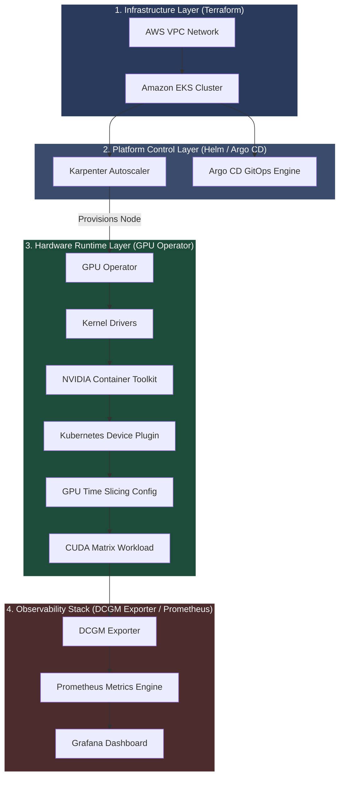
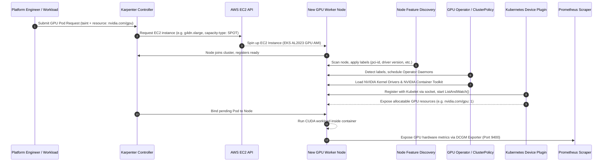

# Systems Architecture & Platform Runtime

This document details the systems architecture, lifecycle orchestration, and data paths of the AI Infrastructure Platform on Amazon EKS.

---

## Architecture Topology

The platform coordinates infrastructure provisioning, system daemon initialization, workload execution, and telemetry scrape streams across four distinct architectural zones:

### Runtime Bootstrapping Sequence

The diagram below details the sequence of node scaling, hardware discovery, dynamic operator driver loading, and service registration:

---

## Core Component Registry

### 1. Karpenter (Just-in-Time Compute Autoscaler)
*   **Mechanics:** Evaluates pending pods' scheduling requirements (e.g., node selectors, taints, and resources like `nvidia.com/gpu`) and directly invokes the AWS EC2 Fleet API (`CreateFleet`) to provision the matching instance.
*   **GPU Optimizations:** Configured via `EC2NodeClass` and `NodePool` to target Spot instance compute families (e.g., `g4dn`, `g6`). Implements custom taints (`nvidia.com/gpu=true:NoSchedule`) to prevent CPU-only pods from scheduling on GPU nodes.
*   *For deep-dive configuration details, see the [Karpenter Scheduling Guide](interview-notes/karpenter.md).*

> [!NOTE] Production Note: Karpenter Provisioning Timing
> Karpenter provisions compute instances and registers them as ready nodes *before* GPU resource capacities are advertised by Kubelet. GPU resource capacity availability only appears in Node Status once the GPU Operator completes driver builds and boots the Kubernetes Device Plugin.

### 2. Node Feature Discovery
*   **Role:** Runs as a DaemonSet to detect node hardware features (specifically physical PCI device identifiers) and publishes them as Kubernetes labels.
*   **Operator Trigger:** Identifies the presence of physical NVIDIA PCI hardware and writes labels (e.g., `feature.node.kubernetes.io/pci-10de.present=true`), which trigger downstream GPU Operator deployments.

### 3. GPU Operator
*   **Orchestration:** Monitored via the `ClusterPolicy` Custom Resource, deploying and reconciling components dynamically on nodes labeled by Node Feature Discovery.
*   **Driver Manager:** Compiles and loads the necessary kernel modules (e.g., `nvidia.ko`, `nvidia-uvm.ko`) dynamically if host-level drivers are not pre-baked into the AMI.
*   **NVIDIA Container Toolkit:** Patches containerd (`/etc/containerd/config.toml`) to register the `nvidia` OCI runtime wrapper, enabling container hardware access.
*   *For operator lifecycle mechanics, see the [GPU Operator Guide](interview-notes/gpu-operator.md).*

### 4. Kubernetes Device Plugin
*   **Role:** Exposes physical GPU allocations to Kubelet.
*   *For registration, watches (`ListAndWatch`), and allocator (`Allocate`) gRPC workflows, see the [Device Plugin Interface Guide](interview-notes/device-plugin.md).*

### 5. GPU Time Slicing
*   **Mechanism:** software-level compute virtualization that replicates a single physical GPU device into multiple virtual units (e.g., presenting 1 physical device as 4 logical units) via a custom ConfigMap.
*   *For sharing capabilities, memory risks, and MPS/MIG benchmarks, see the [Virtualization Models Guide](interview-notes/time-slicing.md).*

> [!NOTE] Production Note: Sharing Model Risks
> GPU Time Slicing is appropriate for low-tier services or inference hosting but is unsuitable for large-scale distributed training due to scheduling latency penalties. Because VRAM is shared with no hardware limits, memory leaks in one container will cause Out-of-Memory (OOM) failures in all other pods sharing that device. Multi-Instance GPU (MIG) should be deployed when hardware-level memory and compute isolation are required.

### 6. DCGM Exporter & Observability Stack
*   **DCGM Exporter:** Exposes GPU hardware metrics (e.g. temperatures, SM clocks, memory usage) gathered from NVML driver hooks on port `9400/metrics`.
*   **Observability Pipeline:** Scrapes exporter endpoints with Prometheus and visualizes device limits on custom Grafana dashboards.
*   *For key metric definitions and alerting threshold rules, see the [Telemetry Metrics Guide](interview-notes/dcgm.md).*

---

## Related Documentation
*   **Operational Manuals:** [Troubleshooting Runbook](troubleshooting.md) | [Hands-on Labs Index](hands-on-labs.md) | [Lessons Learned & Post-Mortems](lessons-learned.md)
*   **Performance Metrics:** [Performance & Scaling Observations](performance.md) | [Roadmap Future Enhancements](roadmap.md)
*   **Sub-Component Architecture:** [Device Plugin Interface](interview-notes/device-plugin.md) | [GPU Operator Internals](interview-notes/gpu-operator.md) | [Virtualization Models](interview-notes/time-slicing.md) | [Telemetry Metrics](interview-notes/dcgm.md) | [Karpenter Scheduling](interview-notes/karpenter.md)
