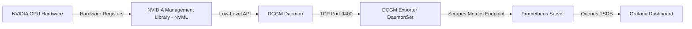

# Systems Architecture: GPU Observability & Telemetry

This document contains deep-dive interview preparation notes, systems design, and conceptual guides on GPU observability using NVIDIA DCGM (Data Center GPU Manager) and Prometheus.

---

## Observability Architecture

GPU observability requires scraping internal device registers and sensor matrices. NVIDIA DCGM runs on the host and exposes these metrics to the Prometheus scraper daemon via the DCGM Exporter.

---

## Important Production Metrics

When operating GPU platforms at scale, monitoring standard CPU and memory metrics is insufficient. You must track hardware health, compute occupancy, memory bandwidth, and throttling signals:

| Metric Name | Description | Diagnostic Value |
|---|---|---|
| `dcgm_sm_copy` | Streaming Multiprocessor (SM) utility percentage. | Measures execution load and code parallelism. |
| `dcgm_fb_used` | Frame Buffer (VRAM) allocated memory in MB. | Identifies memory leaks and VRAM fragmentation. |
| `dcgm_fb_free` | Frame Buffer (VRAM) unallocated memory in MB. | Evaluates if a node has space to launch new models. |
| `dcgm_gpu_temp` | Physical GPU core temperature. | Correlates performance drops to thermal limits. |
| `dcgm_power_usage` | Real-time electrical draw in Watts. | Crucial for tracking carbon footprint and power caps. |
| `dcgm_clock_throttle_reasons` | Bitmask representing current throttle triggers. | Debugs unexpected application slowness (e.g. thermal or power throttles). |
| `dcgm_pcie_tx_throughput` | Host-to-device PCIe write rate (MB/s). | Measures data ingestion bottlenecking during batch transfers. |
| `dcgm_xid_errors` | Raw hardware driver error code flags. | Primary indicator of physical GPU crashes or driver panics. |

---

## Technical Deep-Dives

### 1. DCGM Exporter Mechanics
The DCGM Exporter runs as a DaemonSet on all GPU-enabled nodes.
*   **API Interface:** It binds to the host's `/var/lib/nvidia` driver directory and uses gRPC/NVML channels to communicate with the driver interface.
*   **Telemetry Processing:** It gathers raw metrics from the driver at high frequency, matches them against active pod details (queried from Kubelet's local API endpoint), and exposes the mapped results (annotated with pod name, namespace, and container details) on port `9400/metrics`.

### 2. Throttling and Clock Violations
When a GPU runs heavy workloads, its core frequency might drop. DCGM captures this via `dcgm_clock_throttle_reasons`:
*   **Power Throttling:** The GPU is restricted by its configured electrical cap (e.g. TDP limits).
*   **Thermal Throttling:** Temp limits (e.g. 85°C) are reached, and the GPU drops clock speeds to prevent hardware degradation.
*   **SW Thermal Throttling:** Software safety limits restrict clocks to prevent rapid thermal expansion.

---

## Common Interview Questions & Answers

### Q1: How do you identify a GPU hardware error in Kubernetes logs?
**Answer:** We monitor the `dcgm_xid_errors` metric. An XID error is a system event logged to `syslog` by the NVIDIA driver. A value of `0` means no issues. Any non-zero value represents a specific driver or hardware fault. For example:
*   **XID 31:** Memory page fault (workload read outside of bounds).
*   **XID 43:** GPU driver crash (often requiring a node reboot).
*   **XID 45:** PCIe bus error (hardware disconnection, node becomes NotReady).
We configure Prometheus Alertmanager rules on `dcgm_xid_errors > 0` to page Specalists immediately.

### Q2: Why is the `dcgm_sm_copy` metric more accurate for ML scaling than container CPU metrics?
**Answer:** Container CPU metrics only track host CPU usage. A GPU container executing PyTorch might report 10% CPU usage because it does not block host CPU cycles, but its GPU SM usage (`dcgm_sm_copy`) might be at 100%. SM occupancy directly measures how many GPU Execution Units are active. Scaling decision rules must evaluate `dcgm_sm_copy` or `dcgm_fb_used` to handle scaling demands accurately.

### Q3: How does the exporter associate raw GPU metrics with specific Kubernetes Pod names?
**Answer:** The DCGM Exporter queries the local Kubelet pod resources API endpoint (`/var/lib/kubelet/pod-resources/kubelet.sock`) to discover the active mapping between container IDs, GPU device UUIDs, and Kubernetes pod namespaces. It merges this mapping with raw device statistics, injecting labels like `pod`, `namespace`, and `container` into the prometheus metric payload dynamically.
