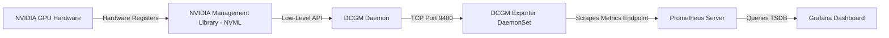

# Systems Design: GPU Observability & Telemetry

This document details GPU observability and telemetry systems using the DCGM Exporter and Prometheus on EKS.

---

## Observability Architecture

GPU observability requires scraping internal device registers and sensor matrices. The DCGM Exporter runs as a DaemonSet on all GPU-enabled nodes to expose these metrics.

---

## Important Production Metrics

| Metric Name | Description | Diagnostic Value |
|---|---|---|
| `dcgm_sm_copy` | Streaming Multiprocessor (SM) utility percentage. | Measures execution load and code parallelism. |
| `dcgm_fb_used` | Frame Buffer (VRAM) allocated memory in MB. | Identifies memory leaks and VRAM fragmentation. |
| `dcgm_fb_free` | Frame Buffer (VRAM) unallocated memory in MB. | Evaluates if a node has space to launch new models. |
| `dcgm_gpu_temp` | Physical GPU core temperature. | Correlates performance drops to thermal limits. |
| `dcgm_power_usage` | Real-time electrical draw in Watts. | Crucial for tracking carbon footprint and power caps. |
| `dcgm_clock_throttle_reasons` | Bitmask representing current throttle triggers. | Debugs unexpected application slowness (e.g. thermal or power throttles). |
| `dcgm_pcie_tx_throughput` | Host-to-device PCIe write rate (MB/s). | Measures data ingestion bottlenecking during batch transfers. |
| `dcgm_xid_errors` | Raw hardware driver error code flags. | Primary indicator of physical GPU crashes or driver panics. |

---

## Technical Deep-Dives

### 1. DCGM Exporter Pod Mapping
The DCGM Exporter queries Kubelet's local pod resources API endpoint (`/var/lib/kubelet/pod-resources/kubelet.sock`) to map container IDs and GPU device UUIDs to pod metadata namespaces. This maps raw hardware counters to specific Kubernetes resources.

### 2. XID Error Codes
An XID error is a critical system event logged by the NVIDIA driver. A non-zero value represents a driver or hardware fault:
*   **XID 31:** Memory page fault (workload attempting to read out of bounds).
*   **XID 43:** GPU driver crash (often requiring a node reboot).
*   **XID 45:** PCIe bus error (hardware disconnection, node transitions to `NotReady`).

### 3. Throttling Mechanics
*   **Power Throttling:** TDP limits are saturated, restricting clocks.
*   **Thermal Throttling:** Core temperature reaches high safety limits (e.g., 85°C), forcing clock drops.

---

## Operational Notes
*   **SM Occupancy Metric Priority:** Standard CPU metrics are insufficient for GPU scaling. Decide scaling rules based on `dcgm_sm_copy` or `dcgm_fb_used`.
*   **High-Resolution Scrapes:** Because GPU executions run in transient bursts, scrape intervals must be reduced to 5s to avoid metric smoothing.
*   **Alerting Triggers:** Configure Prometheus Alertmanager rules to alert on `dcgm_xid_errors > 0` to identify crashing node hardware.
*   **Socket Path Access:** The DCGM Exporter requires host path mounts to read Kubelet socket endpoints for metadata injection.

---

## Related Documentation
*   **Core Systems:** [Architecture Topology](../architecture.md) | [Troubleshooting Runbook](../troubleshooting.md) | [Performance Profiling](../performance.md)
*   **Sub-Component Architecture:** [Device Plugin Interface](device-plugin.md) | [GPU Operator Internals](gpu-operator.md) | [Virtualization Models](time-slicing.md) | [Karpenter Scheduling](karpenter.md)
*   **Detailed Labs:** [05: Observability](../labs/05-dcgm-observability.md)
