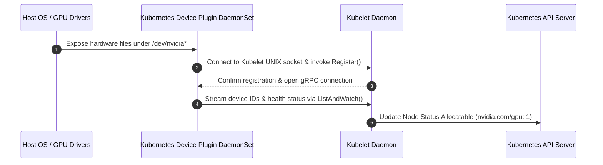

# Systems Design: Kubernetes Device Plugin Interface

This document details the architecture, lifecycle contracts, and container isolation mechanisms of the Kubernetes Device Plugin interface when orchestrating NVIDIA GPUs.

---

## Systems Architecture & Registration Flow

The Kubernetes Device Plugin interface allows external hardware resources to register with Kubelet without modifications to the core Kubernetes control plane.



---

## Core Lifecycle Methods

The Kubernetes Device Plugin implements a gRPC service defined by the following protobuf contract:

```protobuf
service DevicePlugin {
    rpc GetDevicePluginOptions(Empty) returns (DevicePluginOptions) {}
    rpc ListAndWatch(Empty) returns (stream ListAndWatchResponse) {}
    rpc Allocate(AllocateRequest) returns (AllocateResponse) {}
    rpc PreStartContainer(PreStartContainerRequest) returns (PreStartContainerResponse) {}
}
```

*   **`Register()`:** The plugin connects to Kubelet's control socket at `/var/lib/kubelet/device-plugins/kubelet.sock` and announces its gRPC endpoint socket and the resource name (e.g., `nvidia.com/gpu`).
*   **`ListAndWatch()`:** Opens a long-running gRPC streaming connection. The plugin continuously monitors active device UUIDs (via NVML) and reports their health status (Healthy/Unhealthy). If a GPU fails, Kubelet removes it from the allocatable pool.
*   **`Allocate()`:** Executed by Kubelet when scheduling a container requesting `nvidia.com/gpu`. The plugin returns the required host mount paths, device nodes (`/dev/nvidia*`), and environment variables (`NVIDIA_VISIBLE_DEVICES`) to map into the container namespace.

---

## Kubelet Device Manager Internals

The Kubelet Device Manager tracks hardware allocations:
*   **Checkpoint Database:** Active assignments are saved in a local memory database (`/var/lib/kubelet/device-plugins/kubelet_internal_checkpoint`).
*   **Runtime Setup:** Before container creation, Kubelet reads the database, calls `Allocate()` to retrieve character device paths, and configures the OCI payload before passing the execution call to containerd.

---

## Operational Notes
*   **Crash Recovery Resilience:** If the plugin pod crashes, existing containers run unaffected because mounts are already configured. However, new GPU pods cannot schedule on that node until the plugin restarts.
*   **Privileged Host Mounting:** The plugin requires access to Kubelet's socket directory and host `/dev` paths, necessitating a privileged security context configuration.
*   **Integer Allocations:** Kubernetes Extended Resources only support integer allocations. Resource sharing (e.g., decimal values) must be simulated via configurations like [GPU Time Slicing](time-slicing.md).
*   **Fault Detection:** Unhealthy state reporting via `ListAndWatch` triggers automatic rescheduling of new workloads, bypassing damaged hardware.

---

## Related Documentation
*   **Core Systems:** [Architecture Topology](../architecture.md) | [Troubleshooting Runbook](../troubleshooting.md) | [Performance Profiling](../performance.md)
*   **Sub-Component Architecture:** [GPU Operator Internals](gpu-operator.md) | [Virtualization Models](time-slicing.md) | [Telemetry Metrics](dcgm.md) | [Karpenter Scheduling](karpenter.md)
*   **Detailed Labs:** [03: Device Plugin](../labs/03-device-plugin.md)
