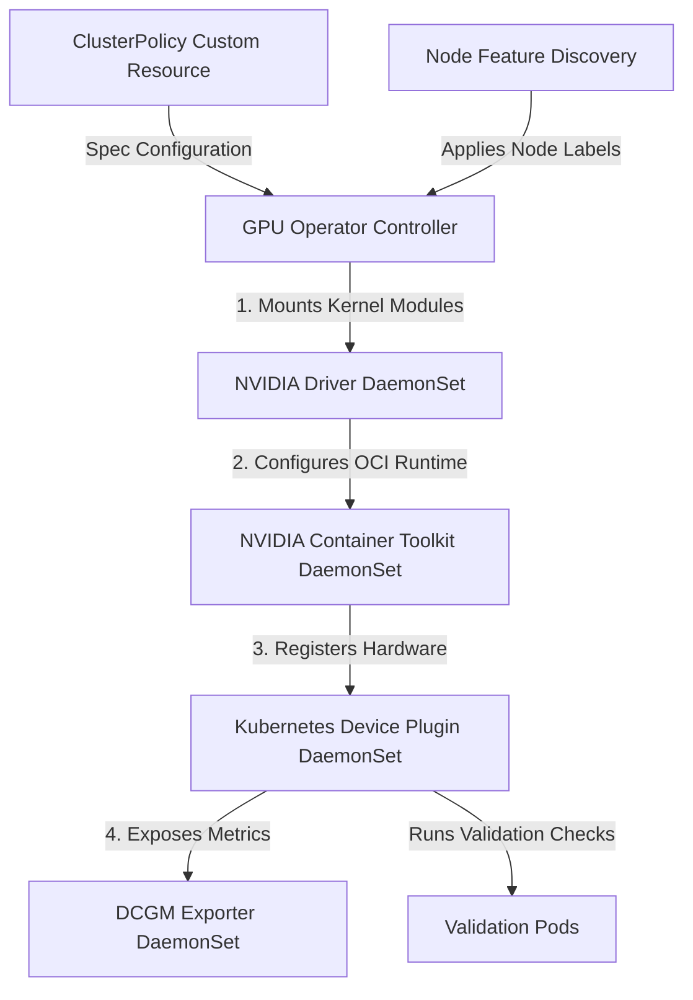

# Systems Design: GPU Operator Internals

This document details the systems design, component dependencies, and operational lifecycle of the GPU Operator.

---

## Operator Systems Architecture

The GPU Operator manages the automated deployment and lifecycle of NVIDIA software components inside a Kubernetes cluster, responding to the `ClusterPolicy` Custom Resource.

---

## Core Components Registry

The Operator manages a sequential pipeline of components, each depending on the successful execution of the previous step:

| Step | Component | Execution Model | Description |
|---|---|---|---|
| **1** | **Node Feature Discovery** | DaemonSet | Scans PCI slots for NVIDIA Vendor IDs (`0x10de`) and labels the node. |
| **2** | **Driver Manager** | DaemonSet (Privileged) | Compiles or loads the kernel drivers (e.g. `nvidia.ko`) dynamically. |
| **3** | **NVIDIA Container Toolkit** | DaemonSet | Configures OCI runtimes (e.g. containerd `/etc/containerd/config.toml`). |
| **4** | **Kubernetes Device Plugin** | DaemonSet | Advertises resources (`nvidia.com/gpu`) to Kubelet. |
| **5** | **DCGM Exporter** | DaemonSet | Exposes telemetry metrics on port `9400`. |
| **6** | **NVIDIA Operator Validator** | StatefulSet / Jobs | Runs validation checks (driver/toolkit/CUDA loops) before scheduling. |

---

## Operational Notes
*   **Hardware Discovery Selector:** The operator targets DaemonSets using labels applied by Node Feature Discovery, ensuring GPU software components are never scheduled on CPU-only nodes.
*   **Runtime Interruptions:** The Container Toolkit must patch containerd configurations and restart the containerd daemon. This restart is brief but transiently interrupts container runtime interface (CRI) communication.
*   **Dynamic Driver Compilations:** Dynamic compilation on node boot requires host kernel headers. In network-restricted environments, proxy configurations or pre-baked AMIs are required.
*   **Reconciliation State Loops:** Malformed configs or kernel mismatch compilation issues can trap the `ClusterPolicy` controller in a `Reconciling` error loop.
*   **Pre-installation Isolation:** Bypassing driver managers by using pre-installed driver AMIs eliminates dynamic kernel compilation failures during dynamic scale-up.

---

## Related Documentation
*   **Core Systems:** [Architecture Topology](../architecture.md) | [Troubleshooting Runbook](../troubleshooting.md) | [Performance Profiling](../performance.md)
*   **Sub-Component Architecture:** [Device Plugin Interface](device-plugin.md) | [Virtualization Models](time-slicing.md) | [Telemetry Metrics](dcgm.md) | [Karpenter Scheduling](karpenter.md)
*   **Detailed Labs:** [02: GPU Operator](../labs/02-gpu-operator.md)
