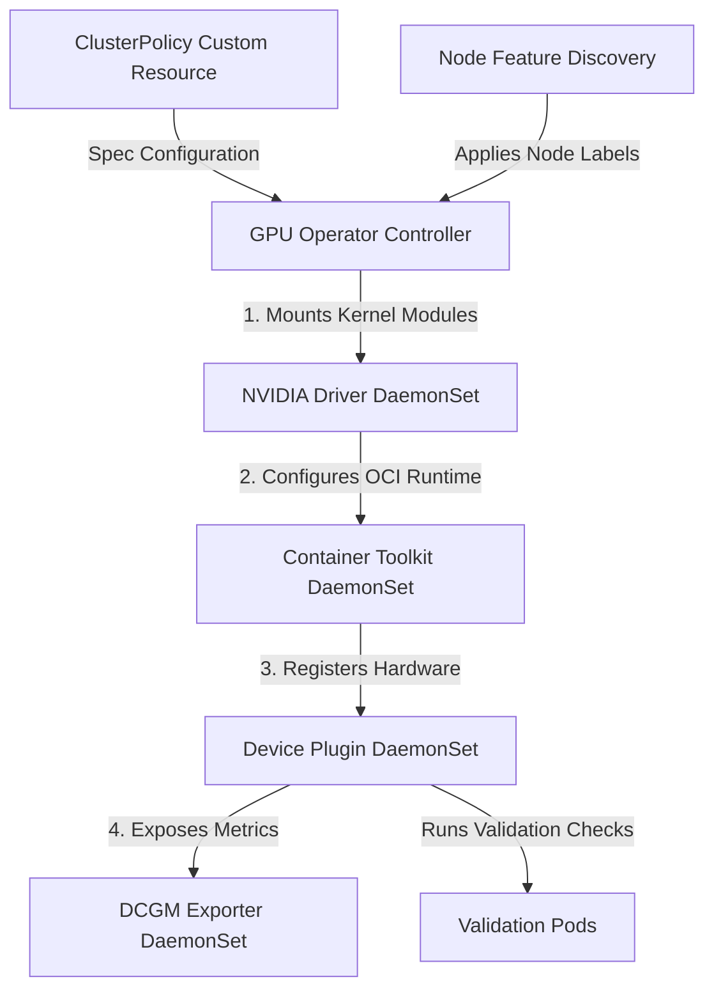

# Systems Architecture: NVIDIA GPU Operator

This document contains deep-dive interview preparation notes, systems design, and conceptual guides on the NVIDIA GPU Operator.

---

## Operator Systems Architecture

The NVIDIA GPU Operator manages the deployment and lifecycle of all NVIDIA software components inside a Kubernetes cluster. It listens for changes to its primary Custom Resource Definition, `ClusterPolicy`, and orchestrates downstream DaemonSets based on hardware detection labels.



---

## Core Components Registry

The Operator manages a pipeline of components, each depending on the successful execution of the previous step:

| Step | Component | Execution Model | Description |
|---|---|---|---|
| **1** | **NFD (Node Feature Discovery)** | DaemonSet | Scans host PCI slots for NVIDIA Vendor IDs (`0x10de`) and labels the node. |
| **2** | **Driver Manager** | DaemonSet (Privileged) | Loads or compiles host kernel drivers (e.g. `nvidia.ko`). Can download pre-compiled packages or run in-tree compilers. |
| **3** | **Container Toolkit** | DaemonSet | Installs the `nvidia-container-toolkit` binaries and patches the host runtime configuration (e.g. `/etc/containerd/config.toml`). |
| **4** | **Device Plugin** | DaemonSet | Registers resources (`nvidia.com/gpu`) with the local Kubelet daemon. |
| **5** | **DCGM Exporter** | DaemonSet | Exposes GPU metrics to Prometheus on port `9400`. |
| **6** | **NVIDIA Operator Validator** | StatefulSet / Jobs | Runs brief validation containers to execute CUDA matrix calculations before allowing production workloads to schedule. |

---

## The `ClusterPolicy` Custom Resource

The configuration of the GPU Operator is managed entirely through a single resource named `ClusterPolicy`. It defines the versions, arguments, and deployment states of all daemon components.
```yaml
apiVersion: nvidia.com/v1
kind: ClusterPolicy
metadata:
  name: gpu-operator-policy
spec:
  driver:
    enabled: true
    repository: nvcr.io/nvidia
    version: "550.54.15"
  toolkit:
    enabled: true
  devicePlugin:
    enabled: true
  dcgmExporter:
    enabled: true
  validator:
    plugin:
      env:
        - name: WITH_WORKLOAD
          value: "true"
```

---

## Component Deep-Dives

### 1. NVIDIA Container Toolkit
The Container Toolkit configures the container runtime (e.g. `containerd` or `cri-o`) to hook into GPU devices.
*   **Mechanics:** It edits containerd's config file to define an `nvidia` runtime class, which points to the binary `/usr/bin/nvidia-container-runtime`.
*   **The Runtime Hook:** When containerd boots a container with the `nvidia` runtime class, the toolkit injects host libraries (like `libcuda.so`) and environment endpoints (like `/dev/nvidia0`) dynamically into the sandbox environment, allowing standard Docker containers to execute CUDA commands.

### 2. Operator Validation Pipeline
Before marking a node as ready to receive applications, the GPU Operator deploys validator containers (`nvidia-operator-validator`) to verify that each stage is operational:
*   **Driver Validation:** Tests communication with the kernel modules (`nvidia-smi` check).
*   **Toolkit Validation:** Confirms host runtime hooks inject libraries successfully.
*   **CUDA Validation:** Runs a simple vector addition workload. If any stage fails, the node is tainted or not labeled, preventing production workloads from landing on broken configurations.

---

## Common Interview Questions & Answers

### Q1: Why does the GPU Operator require Node Feature Discovery (NFD)?
**Answer:** The GPU Operator runs globally on the control plane, but it should only deploy driver and runtime DaemonSet pods to nodes containing actual GPU hardware. NFD scans node hardware dynamically and applies specific label keys. The GPU Operator configures node selectors on its DaemonSets targeting these label keys, ensuring GPU services do not boot on CPU-only instances.

### Q2: How does the GPU Operator compile kernel drivers on nodes dynamically?
**Answer:** The Driver DaemonSet runs in privileged host namespace mode. It mounts the node kernel headers directory (`/usr/src/kernels/` or `/lib/modules/`). If pre-compiled driver packages are not available, it runs an in-tree GCC compiler script to compile the kernel module (`nvidia.ko`) against the host's exact kernel headers and uses `insmod` to load it dynamically into the active kernel.

### Q3: What happens when containment runtime configuration changes are applied by the Toolkit?
**Answer:** The Container Toolkit must patch the runtime configuration files (e.g., containerd's `/etc/containerd/config.toml`) and restart the containerd daemon. This restart is brief but breaks active CRI communication. The GPU Operator orchestrates this gracefully, but if not configured properly, it can cause transient scheduling errors for non-GPU containers running on that node.
