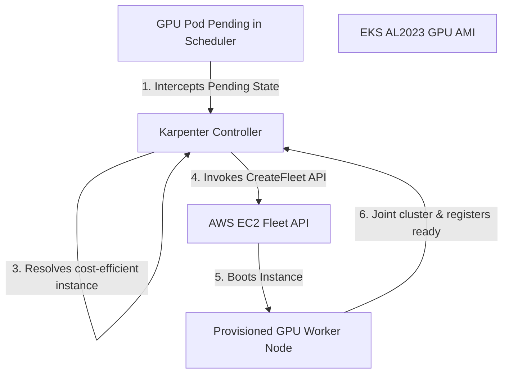

# Systems Architecture: Dynamic Compute Provisioning via Karpenter

This document contains deep-dive interview preparation notes, systems design, and conceptual guides on dynamic EKS autoscaling using Karpenter, specifically targeting GPU workloads.

---

## Karpenter Orchestration Flow

Karpenter bypasses legacy AWS Auto Scaling Groups (ASGs) to provision EC2 instances directly. This architecture is highly optimized for GPU instances, which are expensive and have low capacity pools in certain regions.



---

## Karpenter Configuration Design (Custom Resources)

Karpenter relies on two Custom Resource definitions to control autoscaling behavior:

### 1. `NodePool`
*   **Role:** Defines the scheduling constraints, requirements (e.g. architecture, capacity type, instance types), taints, and scaling limits for the compute nodes.
*   **Example Configurations for GPUs:**
```yaml
apiVersion: karpenter.sh/v1
kind: NodePool
metadata:
  name: gpu-pool
spec:
  template:
    metadata:
      labels:
        accelerator: nvidia-gpu
    spec:
      requirements:
        - key: karpenter.sh/capacity-type
          operator: In
          values: ["spot"]
        - key: node.kubernetes.io/instance-type
          operator: In
          values: ["g4dn.xlarge", "g4dn.2xlarge", "g6.xlarge"]
      taints:
        - key: nvidia.com/gpu
          value: "true"
          effect: NoSchedule
```

### 2. `EC2NodeClass`
*   **Role:** Defines AWS-specific configurations (e.g., subnet selectors, security group selectors, AMIs, storage volumes, and IAM roles).
*   **Example Configurations for GPUs:**
```yaml
apiVersion: karpenter.k8s.aws/v1
kind: EC2NodeClass
metadata:
  name: gpu-pool
spec:
  amiFamily: AL2023
  role: dev-eks-cluster-karpenter-node-role
  amiSelectorTerms:
    - name: amazon-eks-node-al2023-x86_64-nvidia-*
```

---

## Karpenter Disruption & Consolidation

GPU nodes are highly expensive (ranging from ~$1/hr to ~$30+/hr). Karpenter implements automated consolidation policies to optimize runtime billing:
*   **Consolidation Policy (`WhenEmptyOrUnderutilized`):** Karpenter constantly monitors GPU node utilization. If a node has no running workloads (or runs workloads that could be consolidated onto other nodes), it automatically schedules replacements, drains the active workloads, and terminates the redundant instance.
*   **Interruption Handling:** When running Spot capacity, AWS can issue a 2-minute interruption warning. Karpenter intercepts these warnings via SQS queues and immediately begins spinning up a replacement instance, cordoning and draining the target node before the instance is forcefully terminated.

---

## Common Interview Questions & Answers

### Q1: Why is Karpenter preferred over standard Cluster Autoscaler for GPU workloads on EKS?
**Answer:** The standard Cluster Autoscaler (CA) relies on AWS Auto Scaling Groups (ASGs). To scale heterogeneous GPU hardware, you must define separate ASGs for each instance size (e.g., one ASG for `g4dn.xlarge`, one for `g4dn.2xlarge`, etc.). This causes slow scaling cycles and scheduling overhead. 
Karpenter evaluates pending pods and communicates directly with the AWS EC2 Fleet API, request-matching instance sizes dynamically. Karpenter bypasses ASGs completely, booting the exact hardware slice required in less than a minute, which is critical for dynamic ML training or inference workloads.

### Q2: How does Karpenter prevent non-GPU workloads from scheduling on expensive GPU instances?
**Answer:** By applying **Taints** on the Karpenter `NodePool` configuration:
```yaml
taints:
  - key: nvidia.com/gpu
    value: "true"
    effect: NoSchedule
```
When Karpenter provisions a GPU node, it automatically writes this taint to the node object. Standard CPU pods do not tolerate this taint, so they are ignored by the scheduler during node placement. Only pods with matching tolerations (`nvidia.com/gpu=true:NoSchedule`) and selectors can schedule on these nodes.

### Q3: What is the risk of using Spot instances for ML model training, and how do you mitigate it?
**Answer:** The primary risk is sudden interruption. Spot instances can be reclaimed by AWS with a 2-minute warning, which will terminate an active training run. 
To mitigate this:
1.  Enable Karpenter's interruption queue monitoring to catch SQS alerts and spin up replacements immediately.
2.  Incorporate frequent checkpointing (saving model weights to persistent storage like Amazon FSx or S3) inside the training loop.
3.  Use Volcano or Ray to automate gang scheduling and job state recovery during node transitions.
