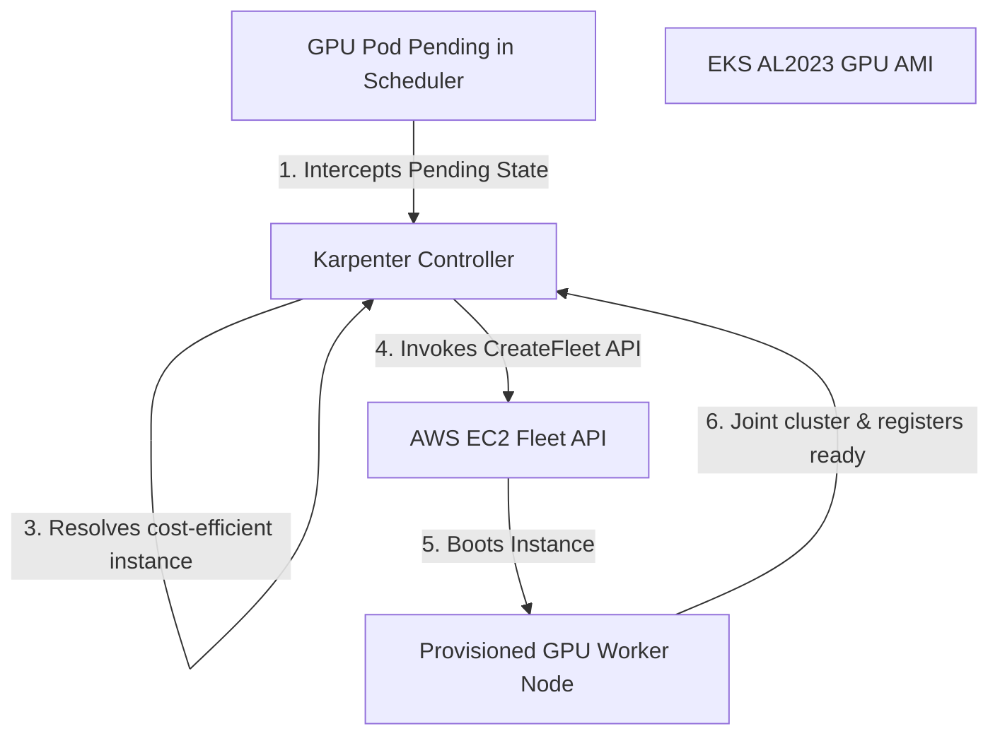

# Systems Design: Dynamic Compute Provisioning via Karpenter

This document details dynamic EKS compute provisioning configurations and scheduling logic using Karpenter, specifically targeting GPU workloads.

---

## Karpenter Orchestration Flow

Karpenter bypasses legacy AWS Auto Scaling Groups (ASGs) to provision EC2 instances directly. This architecture is highly optimized for GPU instances, which are expensive and have low capacity pools in certain regions.

---

## Karpenter Configuration Design (Custom Resources)

Karpenter relies on two Custom Resource definitions to control autoscaling behavior:

### 1. `NodePool`
*   **Role:** Defines scheduling constraints, requirements (e.g. architecture, capacity type, instance types), taints, and scaling limits for the compute nodes.
*   **GPU Optimizations:** Restricts instance types to families like `g4dn` and `g6`, sets taints (`nvidia.com/gpu=true:NoSchedule`), and defines limits to prevent billing overruns.

### 2. `EC2NodeClass`
*   **Role:** Defines AWS-specific configurations (e.g., subnet selectors, security group selectors, AMIs, storage volumes, and IAM roles).
*   **GPU Optimizations:** Selects AMI selectors matching pre-baked driver tags (`amazon-eks-node-al2023-x86_64-nvidia-*`).

---

## Karpenter Disruption & Consolidation

*   **Consolidation Policy (`WhenEmptyOrUnderutilized`):** Karpenter monitors GPU node utilization. If a node is idle or runs workloads that could be consolidated onto other nodes, it schedules replacements, drains active workloads, and terminates the redundant instances to optimize cost.
*   **Interruption Handling:** AWS Spot instances can be reclaimed with a 2-minute warning. Karpenter intercepts these warnings via SQS queues and immediately begins spinning up replacement instances, cordoning and draining the target node before termination.

---

## Operational Notes
*   **ASG Bypassing Advantage:** By bypassing ASGs, Karpenter request-matches instance sizes dynamically and boots nodes in under a minute, significantly faster than traditional Cluster Autoscaler.
*   **Multi-Resource Bottlenecks:** GPU nodes are multi-resource machines. CPU and memory capacities can become bottlenecks before GPU capacity is exhausted. Enforce strict node selectors to isolate resources.
*   **Workload Checkpointing:** Spot instances carry interruption risks. Implement weight checkpointing to Amazon S3/EFS inside the ML training loop, and use frameworks like Ray or Volcano for batch recovery.
*   **Isolation via Taints:** Ensure all GPU NodePools apply taints to prevent standard CPU workloads from scheduling on expensive GPU resources.

---

## Related Documentation
*   **Core Systems:** [Architecture Topology](../architecture.md) | [Troubleshooting Runbook](../troubleshooting.md) | [Performance Profiling](../performance.md)
*   **Sub-Component Architecture:** [Device Plugin Interface](device-plugin.md) | [GPU Operator Internals](gpu-operator.md) | [Virtualization Models](time-slicing.md) | [Telemetry Metrics](dcgm.md)
*   **Detailed Labs:** [01: Provisioning](../labs/01-gpu-node-provisioning.md)
