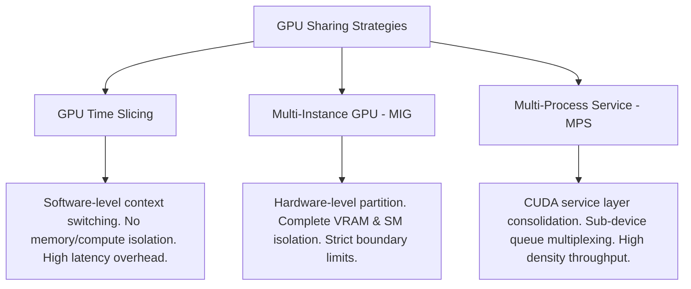

# Systems Design: GPU Sharing & Virtualization

This document details GPU virtualization strategies in Kubernetes, comparing GPU Time Slicing, Multi-Instance GPU (MIG), and Multi-Process Service (MPS).

---

## Core GPU Sharing Taxonomy

In modern AI platforms, reserving a full GPU for a small model inference task is cost-prohibitive. Three primary mechanisms allow multiple workloads to share a single physical accelerator:

---

## Technical Comparison Matrix

| Attribute | GPU Time Slicing | Multi-Instance GPU (MIG) | Multi-Process Service (MPS) |
|---|---|---|---|
| **Partitioning Layer** | Driver Software / Scheduler | Hardware (PCI / Memory) | CUDA Client/Server Proxy |
| **Fault Isolation** | **None** (OOM in one crashes others) | **Complete** (Strict isolation) | **Moderate** (Software limits) |
| **SM Allocation** | Shared (Round-robin switching) | Dedicated (Physical SM slices) | Configurable percentage allocation |
| **VRAM Isolation** | **None** (Shared globally) | **Dedicated** (Hard limits) | Restricted via runtime controls |
| **Hardware Support** | All NVIDIA GPUs (T4, A10G, etc.) | Hopper / Ampere Enterprise only | Kepler architecture and newer |
| **Latency Overhead** | High (Context-switch penalty) | Zero (Parallel hardware lines) | Minimal (Under 10% translation) |

---

## Technical Deep-Dives

### 1. GPU Time Slicing
*   **Mechanism:** The Kubernetes Device Plugin configures a replication factor (e.g. 4) and advertises that resource count to the Kubernetes API. The scheduler tracks these as integer counters (`nvidia.com/gpu: 4`).
*   **Execution:** The driver intercepts kernel executions and schedules them using a round-robin context-switching loop.
*   **VRAM Isolation:** None. All containers share the same global VRAM address space.

### 2. Multi-Instance GPU (MIG)
*   **Mechanism:** Hardware-level partitioning available on modern enterprise architectures (e.g., A100, H100). The GPU is physically divided into up to 7 separate instances.
*   **SM & VRAM Isolation:** Complete. Dedicated memory controllers and SMs prevent fault propagation between instances.

### 3. Multi-Process Service (MPS)
*   **Mechanism:** CUDA runtime-level virtualization. MPS acts as a proxy server, multiplexing CUDA command queues from multiple clients into a single hardware queue.
*   **SM Partitioning:** Enables fine-grained percentage allocations of compute capacity (e.g., in 5% increments).

---

## Trade-offs
*   **GPU Time Slicing Use Cases:** Highly appropriate for low-tier, latency-tolerant services (e.g., developer sandboxes or low-throughput inference).
*   **MIG Use Cases:** Necessary when strict SLA guarantees and security isolation are required (e.g., running untrusted user code or running mixed model training and inference).
*   **MPS Use Cases:** Ideal for high-density, low-latency deployments of small models (e.g., microservices running BERT inference) where throughput is key.
*   **Scheduling Limitations:** For GPU Time Slicing, the scheduler maps virtual requests to the same physical index, meaning cgroup memory usage tracking reports globally rather than per-pod.

---

## Related Documentation
*   **Core Systems:** [Architecture Topology](../architecture.md) | [Troubleshooting Runbook](../troubleshooting.md) | [Performance Profiling](../performance.md)
*   **Sub-Component Architecture:** [Device Plugin Interface](device-plugin.md) | [GPU Operator Internals](gpu-operator.md) | [Telemetry Metrics](dcgm.md) | [Karpenter Scheduling](karpenter.md)
*   **Detailed Labs:** [04: Time-Slicing](../labs/04-time-slicing.md)
