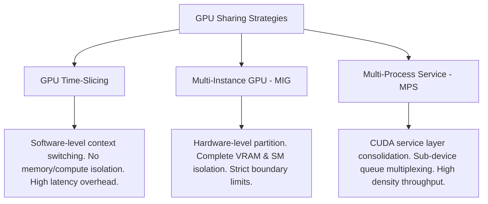

# Systems Architecture: GPU Sharing & Virtualization

This document contains deep-dive interview preparation notes, systems design, and conceptual guides on GPU virtualization strategies in Kubernetes, specifically comparing GPU Time-Slicing, Multi-Instance GPU (MIG), and Multi-Process Service (MPS).

---

## Core GPU Sharing Taxonomy

In modern AI platforms, reserving a full GPU (e.g. an H100 or A10G) for a small model inference or utility service is cost-prohibitive. Three primary mechanisms allow multiple workloads to share a single physical accelerator:

---

## Technical Deep-Dives

### 1. GPU Time-Slicing
*   **Mechanism:** Operates entirely at the software scheduling layer. The NVIDIA Device Plugin replicates the physical GPU resource name into multiple logical endpoints (virtual GPUs). The GPU driver intercepts kernel executions and schedules them using a round-robin time-slicing loop.
*   **Scheduling Execution:** If 4 containers run concurrently on 1 shared GPU, the GPU's context-switcher rotates execution windows across the containers. While Container A executes, Containers B, C, and D wait in memory.
*   **VRAM Isolation:** None. All containers share the same global VRAM address space. If Container A allocates 90% of the VRAM, Container B will fail with an Out-of-Memory (OOM) error when attempting to allocate memory.

### 2. Multi-Instance GPU (MIG)
*   **Mechanism:** Hardware-level partitioning available on modern architectures (e.g. A100, H100). The GPU is divided into up to 7 separate physical GPU instances.
*   **SM & VRAM Isolation:** Strict. Each MIG instance has dedicated memory controllers, cache directories, and Streaming Multiprocessors (SMs). Memory and compute bandwidth are physically isolated.
*   **Safety Profile:** Complete fault isolation. If a process on MIG instance 1 crashes, runs out of memory, or runs an infinite loop, MIG instance 2 is entirely unaffected.

### 3. Multi-Process Service (MPS)
*   **Mechanism:** CUDA runtime-level virtualization. MPS acts as a proxy server. Multiple client processes send CUDA kernels to a single MPS control server, which combines and dispatches them as unified hardware queues.
*   **Compute Partitioning:** Allows strict SM provisioning (e.g. assigning exactly 20% of compute capacity to Pod A and 80% to Pod B).
*   **VRAM Isolation:** Weak. MPS processes share a single address space, but memory limit enforcements can be set at the runtime level.

---

## Technical Comparison Matrix

| Attribute | GPU Time-Slicing | Multi-Instance GPU (MIG) | Multi-Process Service (MPS) |
|---|---|---|---|
| **Partitioning Layer** | Driver Software / Scheduler | Hardware (PCI / Memory) | CUDA Client/Server Proxy |
| **Fault Isolation** | **None** (OOM in one crashes others) | **Complete** (Strict isolation) | **Moderate** (Software limits) |
| **SM Allocation** | Shared (Round-robin switching) | Dedicated (Physical SM slices) | Configurable percentage allocation |
| **VRAM Isolation** | **None** (Shared globally) | **Dedicated** (Hard limits) | Restricted via runtime controls |
| **Hardware Support** | All NVIDIA GPUs (T4, A10G, etc.) | Hopper / Ampere Enterprise only | Kepler architecture and newer |
| **Latency Overhead** | High (Context-switch penalty) | Zero (Parallel hardware lines) | Minimal (Under 10% translation) |

---

## Common Interview Questions & Answers

### Q1: What is the main security risk of using GPU Time-Slicing in a multi-tenant platform?
**Answer:** Time-slicing does not isolate memory. All containers share the same VRAM address space. Any container can allocate arbitrary amounts of VRAM, potentially starving and crashing neighboring containers via Out-of-Memory (OOM) errors. Furthermore, there is no execution boundary; a rogue process executing a long kernel block can hog the SMs, increasing execution latency for other tenants on that card.

### Q2: When would you choose MPS over MIG?
**Answer:** MPS is preferred for high-density, low-latency deployments of small models (e.g., microservices running BERT inference) where hardware isolation is not critical, but throughput is. MPS allows hundreds of concurrent processes to share a single GPU with minimal memory overhead and supports fine-grained SM percentage allocations (e.g., 5% increments). MIG is chosen when strict security, fault isolation, and SLA guarantees are required (e.g., running untrusted user code or mixing model training and inference on the same H100).

### Q3: How does the Kubernetes Scheduler track virtual GPUs under Time-Slicing?
**Answer:** The scheduler has no knowledge of physical GPU boundaries. The NVIDIA Device Plugin configures a replication factor (e.g. 4) and advertises that resource count to the Kubernetes API. The scheduler simply tracks these as integer counters (`nvidia.com/gpu: 4`). The Device Plugin's `Allocate` script maps these virtual requests back to the identical physical PCI slot index, leaving driver context-switching to handle the runtime multiplexing.
