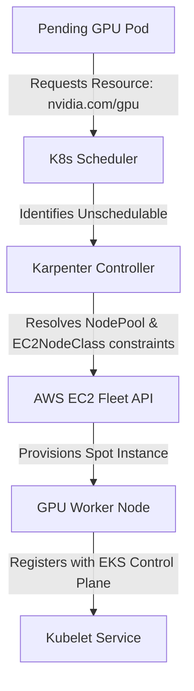

# Lab 1: GPU Node Provisioning with Karpenter

## Objective
Configure Karpenter to dynamically provision GPU-optimized AWS EC2 instances (`g4dn` or `g6` families) on-demand in response to pending Kubernetes workloads that request GPU resources, verifying automatic label and taint application.

---

## Architecture Topology



---

## Configuration Reference

### 1. `NodePool` Definition (`02-platform/karpenter/karpenter-gpu-nodepool.yaml`)
```yaml
apiVersion: karpenter.sh/v1
kind: NodePool
metadata:
  name: gpu-pool
spec:
  template:
    metadata:
      labels:
        accelerator: nvidia-gpu
    spec:
      requirements:
        - key: kubernetes.io/arch
          operator: In
          values: ["amd64"]
        - key: karpenter.sh/capacity-type
          operator: In
          values: ["spot"]
        - key: node.kubernetes.io/instance-type
          operator: In
          values: ["g4dn.xlarge", "g4dn.2xlarge", "g6.xlarge"]
      nodeClassRef:
        group: karpenter.k8s.aws
        kind: EC2NodeClass
        name: gpu-pool
      taints:
        - key: nvidia.com/gpu
          value: "true"
          effect: NoSchedule
  limits:
    cpu: 8
    memory: 32Gi
    nvidia.com/gpu: 2
  disruption:
    consolidationPolicy: WhenEmptyOrUnderutilized
    consolidateAfter: 1m
```

### 2. `EC2NodeClass` Definition (`02-platform/karpenter/karpenter-gpu-nodeclass.yaml`)
```yaml
apiVersion: karpenter.k8s.aws/v1
kind: EC2NodeClass
metadata:
  name: gpu-pool
spec:
  amiFamily: AL2023
  role: dev-eks-cluster-karpenter-node-role
  amiSelectorTerms:
    - name: amazon-eks-node-al2023-x86_64-nvidia-*
  subnetSelectorTerms:
    - tags:
        karpenter.sh/discovery: dev-eks-cluster
  securityGroupSelectorTerms:
    - tags:
        karpenter.sh/discovery: dev-eks-cluster
```

---

## Execution Commands

*   **Purpose:** Apply Karpenter custom resources to the EKS cluster.
    *   **Command:**
        ```bash
        kubectl apply -f 02-platform/karpenter/karpenter-gpu-nodeclass.yaml
        kubectl apply -f 02-platform/karpenter/karpenter-gpu-nodepool.yaml
        ```
    *   **Expected Result:** custom resource configuration schemas created.
    *   **Validation:** Verify Karpenter NodePool status: `kubectl get nodepools`

*   **Purpose:** Deploy a sample workload to trigger dynamic scale-up.
    *   **Command:**
        ```bash
        kubectl apply -f 03-workloads/gpu-test-pod-workloads.yaml
        ```
    *   **Expected Result:** Karpenter detects the pending pod and provisions an EC2 instance.
    *   **Validation:** Monitor joining node: `kubectl get nodes -l accelerator=nvidia-gpu -w`

*   **Purpose:** View Karpenter scheduler logs.
    *   **Command:**
        ```bash
        kubectl logs -n karpenter -l app.kubernetes.io/name=karpenter --tail=100
        ```
    *   **Expected Result:** Logging outputs confirming instance creation triggers.
    *   **Validation:** Match EC2 instance ID to node status list.

---

## Verification Steps

*   **Purpose:** Verify that taints are applied successfully on the node.
    *   **Command:**
        ```bash
        kubectl get node -l accelerator=nvidia-gpu -o jsonpath='{.items[*].spec.taints}'
        ```
    *   **Expected Result:** `[{"effect":"NoSchedule","key":"nvidia.com/gpu","value":"true"}]`
    *   **Validation:** Confirm standard CPU pods cannot be scheduled on the host.

---

## Cleanup
*   **Purpose:** Delete the test pod and trigger node consolidation.
    *   **Command:**
        ```bash
        kubectl delete -f 03-workloads/gpu-test-pod-workloads.yaml
        ```
    *   **Expected Result:** Node drained and terminated.
    *   **Validation:** Verify node deletion: `kubectl get nodes`

---

> [!NOTE] Production Note: Karpenter Provisioning Timing
> Karpenter provisions compute instances and registers them as ready nodes *before* GPU resource capacities are advertised by Kubelet. GPU resource capacity availability only appears in Node Status once the GPU Operator completes driver builds and boots the Kubernetes Device Plugin.

---

## Design Decisions
*   **Spot Capacity Priority:** Configured to target AWS Spot instances (`karpenter.sh/capacity-type: spot`) to reduce idle compute costs.
*   **Strict Taints Isolation:** Imposed `nvidia.com/gpu=true:NoSchedule` to prevent standard non-GPU workloads from occupying multi-resource GPU nodes.
*   **AL2023 GPU AMI Selector:** Targeted official NVIDIA-optimized EKS AMIs to bypass compiling driver layers at node boot.

---

## Related Documentation
*   **Core Systems:** [Architecture Topology](../architecture.md) | [Troubleshooting Runbook](../troubleshooting.md) | [Performance Profiling](../performance.md)
*   **Detailed Labs:** [02: GPU Operator](02-gpu-operator.md) | [03: Device Plugin](03-device-plugin.md) | [04: Time-Slicing](04-time-slicing.md) | [05: Observability](05-dcgm-observability.md) | [06: Troubleshooting](06-production-troubleshooting.md)
*   **Journal Logs:** [Post-Mortems & Lessons Learned](../lessons-learned.md)
