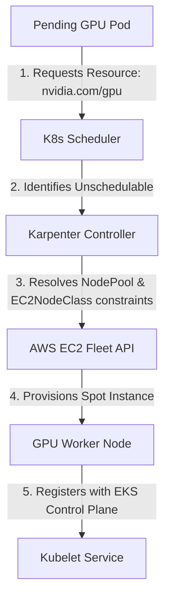

# Lab 1: GPU Node Provisioning with Karpenter

## Objective
Configure Karpenter to dynamically provision GPU-optimized AWS EC2 instances (`g4dn` or `g6` families) on-demand in response to pending Kubernetes workloads that request GPU resources, verifying automatic label and taint application.

---

## Architecture Topology



---

## Configuration Reference

### 1. `NodePool` Definition (`02-platform/karpenter/karpenter-gpu-nodepool.yaml`)
Defines the scheduling constraints, requirements (e.g. Spot capacity, instance types), taints, and scaling limits for the compute nodes.
```yaml
apiVersion: karpenter.sh/v1
kind: NodePool
metadata:
  name: gpu-pool
spec:
  template:
    metadata:
      labels:
        accelerator: nvidia-gpu
    spec:
      requirements:
        - key: kubernetes.io/arch
          operator: In
          values: ["amd64"]
        - key: karpenter.sh/capacity-type
          operator: In
          values: ["spot"]
        - key: node.kubernetes.io/instance-type
          operator: In
          values: ["g4dn.xlarge", "g4dn.2xlarge", "g6.xlarge"]
      nodeClassRef:
        group: karpenter.k8s.aws
        kind: EC2NodeClass
        name: gpu-pool
      taints:
        - key: nvidia.com/gpu
          value: "true"
          effect: NoSchedule
  limits:
    cpu: 8
    memory: 32Gi
    nvidia.com/gpu: 2
  disruption:
    consolidationPolicy: WhenEmptyOrUnderutilized
    consolidateAfter: 1m
```

### 2. `EC2NodeClass` Definition (`02-platform/karpenter/karpenter-gpu-nodeclass.yaml`)
Defines AWS-specific infrastructure configuration:
```yaml
apiVersion: karpenter.k8s.aws/v1
kind: EC2NodeClass
metadata:
  name: gpu-pool
spec:
  amiFamily: AL2023
  role: dev-eks-cluster-karpenter-node-role
  amiSelectorTerms:
    - name: amazon-eks-node-al2023-x86_64-nvidia-*
  subnetSelectorTerms:
    - tags:
        karpenter.sh/discovery: dev-eks-cluster
  securityGroupSelectorTerms:
    - tags:
        karpenter.sh/discovery: dev-eks-cluster
```

---

## Execution Commands

### 1. Apply Karpenter Manifests
Deploy the NodePool and EC2NodeClass to the cluster:
```bash
kubectl apply -f 02-platform/karpenter/karpenter-gpu-nodeclass.yaml
kubectl apply -f 02-platform/karpenter/karpenter-gpu-nodepool.yaml
```

### 2. Deploy Test GPU Workload
Submit a workload requesting GPU capacity to trigger a scale-up event:
```bash
kubectl apply -f 03-workloads/gpu-test-pod-workloads.yaml
```

### 3. Inspect Karpenter Logs
Observe Karpenter intercepting the pending pod and resolving the EC2 capacity:
```bash
kubectl logs -n karpenter -l app.kubernetes.io/name=karpenter --tail=100 -f
```

---

## Expected Output
Karpenter controller logs:
```text
2026-07-15T20:26:10Z INFO karpenter.scheduler Found 1 pending pod(s) requesting nvidia.com/gpu: 1
2026-07-15T20:26:11Z INFO karpenter.scheduler Nominated nodeclaim gpu-pool-abc12 for pod default/gpu-test-pod-1
2026-07-15T20:26:12Z INFO karpenter.cloudprovider Created nodeclaim gpu-pool-abc12 with instance g4dn.xlarge, zone us-east-1a, capacity-type spot
2026-07-15T20:26:45Z INFO karpenter.node Registered new node dev-eks-cluster-gpu-pool-abc12
```

---

## Verification Steps

### 1. Check Node Join Status
Verify that the new GPU worker node has successfully joined the cluster:
```bash
kubectl get nodes -l accelerator=nvidia-gpu
```

### 2. Inspect Node Taints & Labels
Ensure Karpenter correctly applied the designated taints and labels to prevent CPU workloads from landing on the node:
```bash
kubectl get node -l accelerator=nvidia-gpu -o jsonpath='{.items[*].spec.taints}'
```
Expected output:
```json
[{"effect":"NoSchedule","key":"nvidia.com/gpu","value":"true"}]
```

---

## Cleanup
Deregister the workload to trigger Karpenter scale-down and consolidation:
```bash
kubectl delete -f 03-workloads/gpu-test-pod-workloads.yaml
```

---

> [!NOTE] Engineering Note: Karpenter Provisioning Timing
> Karpenter provisions the EC2 instance and registers the node in Kubernetes *before* actual GPU device capacity is advertised. GPU resource availability (`nvidia.com/gpu`) only appears in the node's allocatable capacity status *after* the GPU Operator has successfully loaded kernel drivers and registered the NVIDIA Device Plugin with Kubelet.

---

## Interview Takeaways

*   **Whiteboard Diagramming:** Be prepared to map out how Karpenter intercepts the pending pod queue (evaluating taints/tolerations, labels, and CPU/GPU resources) and translates this directly to the AWS EC2 Fleet API (`CreateFleet`), bypassing legacy Auto Scaling Groups.
*   **Instance Selection Decisions:** Karpenter selects instance types based on the specifications in the `NodePool` requirements (e.g. constraints limiting selection to `g4dn` or `g6` families) and selects the most cost-efficient instance available in the target AWS Subnet zones.
*   **Taint Isolation Rationale:** Explain that the `nvidia.com/gpu=true:NoSchedule` taint is necessary to ensure standard CPU microservices do not schedule on expensive GPU nodes, preventing resource exhaustion and cost runaways.
