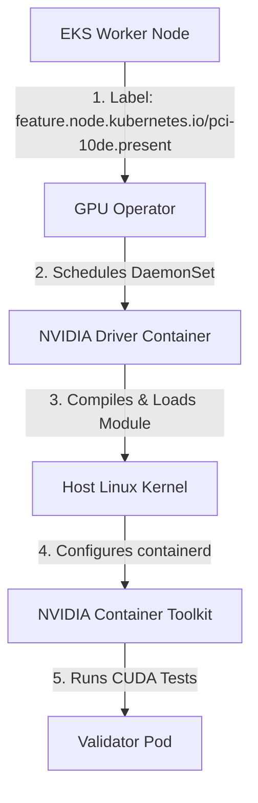

# Lab 2: Automated GPU Lifecycle with the NVIDIA GPU Operator

## Objective
Install and configure the NVIDIA GPU Operator via Helm. Validate that the operator successfully detects GPU hardware labels on Karpenter-provisioned nodes, triggers the dynamic compilation and loading of drivers, sets up the container toolkit runtime class, and completes vector validation.

---

## Architecture Topology



---

## Configuration Reference

### GPU Driver Delivery Modes
The GPU Operator can manage drivers in two main ways, configured inside the `ClusterPolicy` Custom Resource:
1.  **Dynamic Kernel Compilation (Default):** The operator schedules a compiler container (`nvidia-driver-daemonset`) containing GCC and kernel header packages. The container compiles the driver module (`nvidia.ko`) against the host's active kernel version and inserts it.
2.  **Pre-Installed / Pre-Baked Mode:** If the host AMI already has the drivers compiled and pre-loaded (such as when using the official AWS EKS-optimized AL2023 GPU AMI), the Operator's driver installation stage is bypassed, and it immediately proceeds to configure the Container Toolkit and Device Plugin.

```yaml
# Snippet of ClusterPolicy configuration for pre-installed drivers
spec:
  driver:
    enabled: false # Disables the driver installer DaemonSet; assumes host drivers are active
  toolkit:
    enabled: true
  devicePlugin:
    enabled: true
```

---

## Execution Commands

### 1. Register NVIDIA Helm Repository
```bash
helm repo add nvidia https://helm.ngc.nvidia.com/nvidia-dev
helm repo update
```

### 2. Install the GPU Operator
Deploy the GPU Operator to its own namespace:
```bash
helm install gpu-operator nvidia/gpu-operator \
  --namespace gpu-operator \
  --create-namespace \
  --version v24.3.0
```

### 3. Track ClusterPolicy Reconciliation
The GPU Operator configures components according to the custom `ClusterPolicy` resource named `default`. Monitor the reconciliation progress:
```bash
kubectl get clusterpolicy default -w
```

---

## Expected Output
Running `kubectl get pods -n gpu-operator` should show the initialized daemon layers:
```text
NAME                                                  READY   STATUS      RESTARTS   AGE
gpu-operator-6b7dfbfd5-xxxx                           1/1     Running     0          5m
nvidia-driver-daemonset-xxxx                          1/1     Running     0          4m
nvidia-container-toolkit-daemonset-xxxx               1/1     Running     0          3m
nvidia-device-plugin-daemonset-xxxx                   1/1     Running     0          2m
nvidia-operator-validator-xxxx                        0/1     Completed   0          1m
```

---

## Verification Steps

### 1. Inspect Driver Load Status
Exec into the driver container to verify host driver communication:
```bash
kubectl exec -n gpu-operator ds/nvidia-driver-daemonset -- nvidia-smi
```
Expected output:
```text
+-----------------------------------------------------------------------------------------+
| NVIDIA-SMI 550.54.15              Driver Version: 550.54.15      CUDA Version: 12.4     |
|-----------------------------------------+------------------------+----------------------+
| GPU  Name                 Persistence-M | Bus-Id          Disp.A | Volatile Uncorr. ECC |
| Fan  Temp   Perf          Pwr:Usage/Cap |          Memory-Usage  | GPU-Util  Compute M. |
|                                         |                        |               MIG M. |
|=========================================+========================+======================|
|   0  Tesla T4                       On  | 00000000:00:1E.0   Off |                    0 |
| N/A   35C    P8             9W /  70W   |      0MiB / 15360MiB   |      0%      Default |
|                                         |                        |                  N/A |
+-----------------------------------------+------------------------+----------------------+
```

### 2. Verify Operator Validation Results
Verify that the `nvidia-operator-validator` pods have successfully executed their checks and exited:
```bash
kubectl get pods -n gpu-operator -l app=nvidia-operator-validator
```

---

## Cleanup
If you need to uninstall the operator stack:
```bash
helm uninstall gpu-operator -n gpu-operator
```

---

> [!NOTE] Engineering Note: Container Toolkit Injection
> The NVIDIA Container Toolkit does not compile workloads. It patches containerd's `/etc/containerd/config.toml` to register an OCI runtime hook. When a pod requesting GPU capacity starts, the hook intercepts the sandbox creation and binds host-level NVIDIA libraries (`libcuda.so`) and device character interfaces (`/dev/nvidia*`) directly into the container namespace.

---

## Interview Takeaways

*   **Operator Value Proposition:** Explain that the GPU Operator automates the operational steps required to prepare a bare Linux node to run GPU workloads, including kernel driver compilation, runtime configurations, and hardware health checks.
*   **Whiteboarding Driver Compilation vs Pre-Baked:** Be ready to discuss the trade-offs of dynamic compilation (flexible across node AMIs but slow and dependent on external packages) vs pre-baked drivers (fast node boot times, highly secure private subnets, but tied to specific AMI versions).
*   **Validator Workflow:** Explain that the operator uses validator pods to run sanity tests (e.g. testing host driver connection and performing vector addition via CUDA) before making the node available to customer applications.
