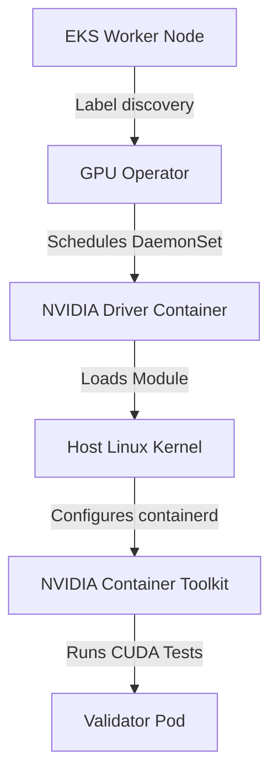

# Lab 2: Automated GPU Lifecycle with the GPU Operator

## Objective
Install and configure the GPU Operator via Helm. Validate that the operator detects hardware capability labels on Karpenter-provisioned nodes, compiles and loads driver components, sets up the runtime class, and completes validation routines.

---

## Architecture Topology



---

## Configuration Reference

### GPU Driver Delivery Modes
The GPU Operator can manage drivers in two main ways, configured inside the `ClusterPolicy` Custom Resource:
1.  **Dynamic Kernel Compilation:** The operator compiles the driver module (`nvidia.ko`) against the host's active kernel version dynamically at node startup.
2.  **Pre-Installed Mode:** If drivers are pre-baked into the node AMI (e.g. using the official AWS EKS-optimized AL2023 GPU AMI), the Operator's driver installation stage is bypassed.

```yaml
spec:
  driver:
    enabled: false # Bypasses dynamic compiler and module load; assumes host drivers are active
  toolkit:
    enabled: true
  devicePlugin:
    enabled: true
```

---

## Execution Commands

*   **Purpose:** Register the NVIDIA Helm repository.
    *   **Command:**
        ```bash
        helm repo add nvidia https://helm.ngc.nvidia.com/nvidia-dev && helm repo update
        ```
    *   **Expected Result:** Remote charts repository database updated.
    *   **Validation:** Verify registry output.

*   **Purpose:** Install the GPU Operator.
    *   **Command:**
        ```bash
        helm install gpu-operator nvidia/gpu-operator -n gpu-operator --create-namespace --version v24.3.0
        ```
    *   **Expected Result:** Daemonsets and CRDs deployed.
    *   **Validation:** Check active pods: `kubectl get pods -n gpu-operator`

*   **Purpose:** Track ClusterPolicy reconciliation progress.
    *   **Command:**
        ```bash
        kubectl get clusterpolicy default -w
        ```
    *   **Expected Result:** Policy status transitions to `Ready`.
    *   **Validation:** Verify that all validation jobs run and exit cleanly.

---

## Verification Steps

*   **Purpose:** Verify host driver communication status.
    *   **Command:**
        ```bash
        kubectl exec -n gpu-operator ds/nvidia-driver-daemonset -- nvidia-smi
        ```
    *   **Expected Result:** GPU performance report showing device details, driver versions, and SM load.
    *   **Validation:** Check memory utilization lists.

---

## Cleanup
*   **Purpose:** Uninstall the operator deployment.
    *   **Command:**
        ```bash
        helm uninstall gpu-operator -n gpu-operator
        ```
    *   **Expected Result:** Cleanup of all GPU Operator daemons.
    *   **Validation:** Confirm namespace is empty: `kubectl get pods -n gpu-operator`

---

> [!NOTE] Production Note: Container Runtime Restart
> The NVIDIA Container Toolkit patchescontaind's configuration. The restart of the container runtime (containerd) is brief but momentarily interrupts active CRI communications on the node.

---

## Production Considerations
*   **Pre-baked Drivers for Speed:** Avoid compiling drivers at boot time in production. Use pre-baked GPU AMIs to reduce node bootstrap latency by 30 seconds.
*   **Version Pinning:** Pin the `ClusterPolicy` and Helm chart versions strictly to prevent automatic driver upgrades from triggering cluster-wide node interruptions.
*   **Resource Caps:** Enforce CPU/Memory limits on driver compile containers to prevent host-level resource exhaustion during scaling events.

---

## Related Documentation
*   **Core Systems:** [Architecture Topology](../architecture.md) | [Troubleshooting Runbook](../troubleshooting.md) | [Performance Profiling](../performance.md)
*   **Detailed Labs:** [01: Provisioning](01-gpu-node-provisioning.md) | [03: Device Plugin](03-device-plugin.md) | [04: Time-Slicing](04-time-slicing.md) | [05: Observability](05-dcgm-observability.md) | [06: Troubleshooting](06-production-troubleshooting.md)
*   **Journal Logs:** [Post-Mortems & Lessons Learned](../lessons-learned.md)
