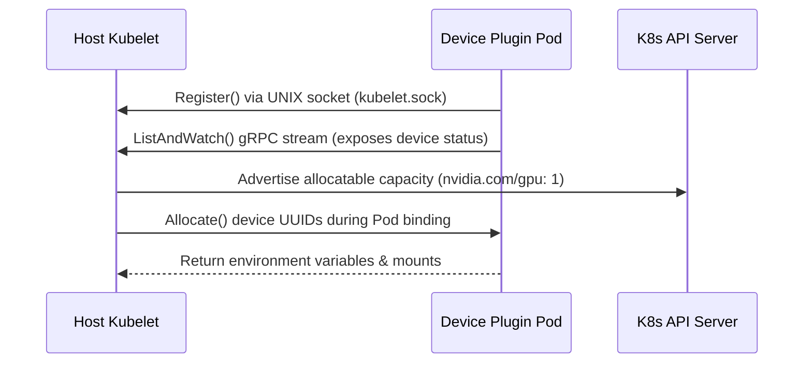

# Lab 3: Validate the Kubernetes Device Plugin Interface

## Objective
Verify the registration and communication lifecycle of the Kubernetes Device Plugin. Validate the host socket registration call, resource advertisement metrics, and runtime device identifier mounts.

---

## Architecture Topology



---

## Configuration Reference

### Kubelet Socket Endpoint Location
The plugin targets the host path UNIX socket for communication:
```yaml
volumeMounts:
  - name: device-plugin
    mountPath: /var/lib/kubelet/device-plugins
```

---

## Execution Commands

*   **Purpose:** Verify Device Plugin pod execution.
    *   **Command:**
        ```bash
        kubectl get pods -n gpu-operator -l app=nvidia-device-plugin-daemonset
        ```
    *   **Expected Result:** Container reports `Running`.
    *   **Validation:** Check event logs if stuck in initialization.

*   **Purpose:** Check registration handshake output.
    *   **Command:**
        ```bash
        kubectl logs -n gpu-operator -l app=nvidia-device-plugin-daemonset --tail=50
        ```
    *   **Expected Result:** Logs indicating `Register()` and `ListAndWatch()` gRPC streams are active.
    *   **Validation:** Verify registration socket connects successfully.

*   **Purpose:** Verify EKS Node Capacity.
    *   **Command:**
        ```bash
        kubectl describe node -l accelerator=nvidia-gpu | grep -A 5 "Allocatable"
        ```
    *   **Expected Result:** `nvidia.com/gpu` capacity is advertised.
    *   **Validation:** Check capacity values.

---

## Verification Steps

*   **Purpose:** Run a CUDA matrix multiplier to confirm allocation environment mapping.
    *   **Command:**
        ```bash
        kubectl apply -f 03-workloads/gpu-test-deployment.yaml
        ```
    *   **Expected Result:** Pod binds, launches, and performs calculations.
    *   **Validation:** Execute `kubectl exec <pod-name> -- env | grep NVIDIA_VISIBLE_DEVICES` to verify mapped hardware UUIDs.

---

## Cleanup
*   **Purpose:** Delete the verification deployment.
    *   **Command:**
        ```bash
        kubectl delete -f 03-workloads/gpu-test-deployment.yaml
        ```
    *   **Expected Result:** Containers terminated.
    *   **Validation:** Check pod listing status.

---

> [!NOTE] Production Note: Capacity Scarcity
> Kubelet zero-allocates capacity if the device plugin experiences connection timeouts or socket permission blockages. Monitor socket communication errors closely.

---

## Operational Notes
*   **Socket Path Access:** Ensure host path mounts have root directory write capabilities. Selinux or AppArmor profiles blocking UNIX socket access are common root causes of connection failures.
*   **Unhealthy Device Exclusions:** The Device Plugin automatically excludes faulty GPUs from the allocatable pool if `ListAndWatch` reports hardware errors, preventing silent workload corruption.
*   **Environment Mappings:** Workload isolation relies on the plugin injecting `NVIDIA_VISIBLE_DEVICES` to container namespaces. Ensure security contexts allow container runtime hooks to apply these rules.

---

## Related Documentation
*   **Core Systems:** [Architecture Topology](../architecture.md) | [Troubleshooting Runbook](../troubleshooting.md) | [Performance Profiling](../performance.md)
*   **Detailed Labs:** [01: Provisioning](01-gpu-node-provisioning.md) | [02: GPU Operator](02-gpu-operator.md) | [04: Time-Slicing](04-time-slicing.md) | [05: Observability](05-dcgm-observability.md) | [06: Troubleshooting](06-production-troubleshooting.md)
*   **Journal Logs:** [Post-Mortems & Lessons Learned](../lessons-learned.md)
