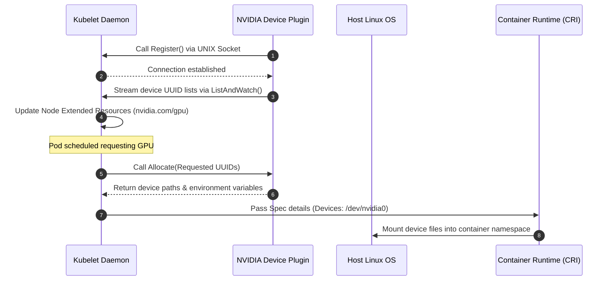

# Lab 3: Hardware Resource Advertisement with the NVIDIA Device Plugin

## Objective
Investigate the runtime operations of the NVIDIA Device Plugin. Examine the gRPC service contract (`Register`, `ListAndWatch`, `Allocate`), verify how Kubelet registers the resources as Extended Resources, and trace host device node mapping (`/dev/nvidia*`) inside running container namespaces.

---

## Architecture Topology



---

## Technical Concept Deep-Dive

### 1. Extended Resources
Kubernetes only tracks CPU, Memory, and Ephemeral Storage natively. Any other custom hardware (like GPUs or FPGAs) must be registered as **Extended Resources** (`nvidia.com/gpu`).
*   **Integer Math:** Extended Resources are tracked as integer quantities. The scheduler enforces resource availability based on node capacity decrements.
*   **No Overcommit:** Unlike CPU, extended resources cannot be overcommitted.

### 2. Kubelet Device Manager Checkpointing
The Kubelet process maintains a local database file (`/var/lib/kubelet/device-plugins/kubelet_internal_checkpoint`) to track which container is allocated to which specific GPU physical index (UUID). If Kubelet restarts, it reads this file to reconstruct active device assignments.

---

## Execution Commands

### 1. Inspect Device Plugin Logs
Review the registration loop output of the Device Plugin:
```bash
kubectl logs -n gpu-operator -l app=nvidia-device-plugin-daemonset --tail=50
```

### 2. Verify Node Extended Resource Capacity
Examine if the node successfully advertises `nvidia.com/gpu` capacity to EKS:
```bash
kubectl describe node -l accelerator=nvidia-gpu | grep -A 5 -E "Capacity|Allocatable"
```

### 3. Trace Container Namespace Mounts
Verify that a running GPU container has host character device nodes mounted. Boot a test container and run an execution check:
```bash
# Verify character devices exist inside container
kubectl run device-check --image=nvidia/cuda:12.0.0-base-ubuntu20.04 \
  --restart=Never --limits="nvidia.com/gpu=1" -- \
  ls -la /dev/ | grep nvidia
```

---

## Expected Output
Log output from the validation container:
```text
crw-rw-rw-  1 root root 195,   0 Jul 15 20:30 nvidia0
crw-rw-rw-  1 root root 195, 255 Jul 15 20:30 nvidiactl
crw-rw-rw-  1 root root 195, 254 Jul 15 20:30 nvidia-uvm
```

---

## Verification Steps

### 1. Confirm Checkpoint State
Verify Kubelet is actively tracking device plugins by verifying active UNIX socket endpoints on the host filesystem:
```bash
# Command executed on the host node
ls -la /var/lib/kubelet/device-plugins/
```
Expected output:
```text
srwxr-xr-x 1 root root 0 Jul 15 20:10 kubelet.sock
srwxr-xr-x 1 root root 0 Jul 15 20:15 nvidia-gpu.sock
-rw-r--r-- 1 root root 402 Jul 15 20:15 kubelet_internal_checkpoint
```

---

## Cleanup
Remove the test check pod:
```bash
kubectl delete pod device-check
```

---

> [!NOTE] Engineering Note: Device Plugin Allocation Limits
> The Device Plugin acts as an registry and allocator, but it *does not mount* the physical hardware files into the container. Kubelet receives the device targets from the plugin's `Allocate` return payload and instructs the container runtime (e.g. containerd) to mount the device nodes (`/dev/nvidia*`) and restrict namespace namespaces via cgroups.

---

## Interview Takeaways

*   **ホワイトボード: Explain Register → ListAndWatch → Allocate:**
    *   **Register:** Device plugin registers its resource identifier (`nvidia.com/gpu`) and UNIX socket path.
    *   **ListAndWatch:** The plugin keeps a gRPC stream open to notify Kubelet of device list changes and health statuses.
    *   **Allocate:** The scheduler assigns the pod. Kubelet calls the plugin, which translates UUID selections into physical host device mounts and environment injection specs.
*   **Host Character Devices:** Be prepared to list critical character device files: `/dev/nvidiactl` (control commands), `/dev/nvidia-uvm` (unified memory driver access), and `/dev/nvidia[0-7]` (specific physical GPU slots).
*   **State Recovery:** Explain that Kubelet relies on `/var/lib/kubelet/device-plugins/kubelet_internal_checkpoint` to recover allocations after a Kubelet restart. If this file is corrupted, Kubelet may double-allocate GPUs, causing runtime CUDA errors.
