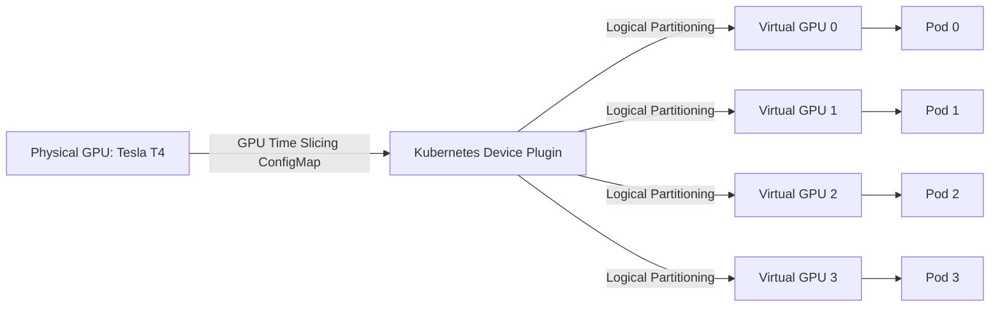

# Lab 4: GPU Time Slicing & Sharing Configurations

## Objective
Configure GPU Time Slicing using a Custom ConfigMap. Validate the logical allocation expansion (e.g. presenting 1 physical GPU as 4 virtual devices) and verify concurrent container executions on the shared accelerator card.

---

## Architecture Topology



---

## Configuration Reference

### GPU Time Slicing ConfigMap (`02-platform/karpenter/karpenter-gpu-nodeclass.yaml`)
```yaml
apiVersion: v1
kind: ConfigMap
metadata:
  name: device-plugin-config
  namespace: gpu-operator
data:
  time-slicing-config: |-
    version: v1
    sharing:
      timeSlicing:
        resources:
          - name: nvidia.com/gpu
            replicas: 4
```

---

## Execution Commands

*   **Purpose:** Deploy the time-slicing ConfigMap.
    *   **Command:**
        ```bash
        kubectl apply -f 02-platform/karpenter/karpenter-gpu-nodeclass.yaml
        ```
    *   **Expected Result:** ConfigMap created in the `gpu-operator` namespace.
    *   **Validation:** Verify ConfigMap keys: `kubectl describe configmap -n gpu-operator device-plugin-config`

*   **Purpose:** Patch the GPU Operator's `ClusterPolicy` to load the sharing configuration.
    *   **Command:**
        ```bash
        kubectl patch clusterpolicy default --type=merge -p '{"spec":{"devicePlugin":{"config":{"name":"device-plugin-config","default":"time-slicing-config"}}}}'
        ```
    *   **Expected Result:** ClusterPolicy updates. The Device Plugin daemonset restarts.
    *   **Validation:** Check restart progress: `kubectl rollout status daemonset/nvidia-device-plugin-daemonset -n gpu-operator`

*   **Purpose:** Check advertised GPU capacity.
    *   **Command:**
        ```bash
        kubectl describe node -l accelerator=nvidia-gpu | grep nvidia.com/gpu
        ```
    *   **Expected Result:** Node capacity shows `nvidia.com/gpu: 4` (instead of 1).
    *   **Validation:** Verify allocatable capacity details.

---

## Verification Steps

*   **Purpose:** Deploy 4 workloads requesting 1 GPU unit each.
    *   **Command:**
        ```bash
        kubectl apply -f 03-workloads/gpu-test-pod-workloads.yaml
        ```
    *   **Expected Result:** All 4 pods transition to a `Running` status on the same physical node.
    *   **Validation:** Verify scheduling layout: `kubectl get pods -o wide -l app=gpu-load-test`

---

## Cleanup
*   **Purpose:** Remove time-slicing configurations and restore default policy.
    *   **Command:**
        ```bash
        kubectl patch clusterpolicy default --type=json -p='[{"op": "remove", "path": "/spec/devicePlugin/config"}]'
        kubectl delete configmap device-plugin-config -n gpu-operator
        ```
    *   **Expected Result:** Device Plugin config resets to default mode.
    *   **Validation:** Verify node capacity returns to `1`.

---

> [!NOTE] Production Note: No VRAM Isolation
> GPU Time Slicing partitions compute using a round-robin schedule but does not isolate memory. Any container exceeding its memory limit triggers Out-of-Memory (OOM) errors across all other containers sharing that physical GPU.

---

## Trade-offs
*   **Pros (Density & Cost):** Dramatically increases hardware utilization and reduces idle compute costs for lightweight workloads.
*   **Cons (No Memory Boundaries):** Lacks hardware-level memory boundaries. One pod leaking memory can crash all other pods sharing the card.
*   **Cons (Compute Latency):** Round-robin driver-level context switching adds a **15-25% execution latency penalty** for heavy compute workloads.

---

## Related Documentation
*   **Core Systems:** [Architecture Topology](../architecture.md) | [Troubleshooting Runbook](../troubleshooting.md) | [Performance Profiling](../performance.md)
*   **Detailed Labs:** [01: Provisioning](01-gpu-node-provisioning.md) | [02: GPU Operator](02-gpu-operator.md) | [03: Device Plugin](03-device-plugin.md) | [05: Observability](05-dcgm-observability.md) | [06: Troubleshooting](06-production-troubleshooting.md)
*   **Journal Logs:** [Post-Mortems & Lessons Learned](../lessons-learned.md)
