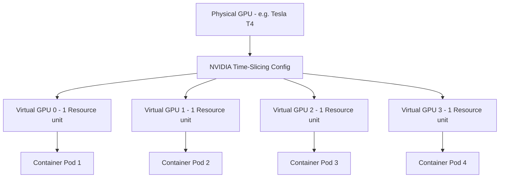

# Lab 4: Resource Partitioning with GPU Time-Slicing

## Objective
Configure GPU Time-Slicing via a custom ConfigMap to partition a single physical GPU into 4 virtual GPU devices. Verify that EKS successfully schedules 4 concurrent pods on the same physical node and explore VRAM and compute isolation trade-offs.

---

## Architecture Topology



---

## Configuration Reference

### 1. Time-Slicing ConfigMap Definition (`02-platform/karpenter/karpenter-gpu-nodeclass.yaml` or a dedicated manifest)
This ConfigMap defines the replication factor. Applying this config tells the device plugin to advertise 4 virtual GPU units for every physical GPU discovered.
```yaml
apiVersion: v1
kind: ConfigMap
metadata:
  name: device-plugin-config
  namespace: gpu-operator
data:
  time-slicing-config: |-
    version: v1
    sharing:
      timeSlicing:
        resources:
          - name: nvidia.com/gpu
            replicas: 4
```

### 2. Referencing the ConfigMap inside `ClusterPolicy`
Configure the GPU Operator's `devicePlugin` configuration spec to load the ConfigMap:
```yaml
spec:
  devicePlugin:
    config:
      name: device-plugin-config
      default: time-slicing-config
```

---

## Execution Commands

### 1. Apply Time-Slicing ConfigMap
```bash
kubectl apply -f - <<EOF
apiVersion: v1
kind: ConfigMap
metadata:
  name: device-plugin-config
  namespace: gpu-operator
data:
  time-slicing-config: |-
    version: v1
    sharing:
      timeSlicing:
        resources:
          - name: nvidia.com/gpu
            replicas: 4
EOF
```

### 2. Patch GPU Operator ClusterPolicy
Instruct the operator to load the config mapping:
```bash
kubectl patch clusterpolicy default --type=merge -p '{"spec":{"devicePlugin":{"config":{"name":"device-plugin-config","default":"time-slicing-config"}}}}'
```

### 3. Deploy Multi-Pod Workload
Schedule 4 workload pods requesting 1 GPU each:
```bash
kubectl apply -f 03-workloads/gpu-test-pod-workloads.yaml
```

---

## Expected Output
Review the status of the node allocatable capacity. A physical single-GPU node (e.g. 1 physical Tesla T4) should now report:
```text
Capacity:
  nvidia.com/gpu: 4
Allocatable:
  nvidia.com/gpu: 4
```
All 4 workloads should schedule and transition to a `Running` status on the same node:
```text
NAME                     READY   STATUS    NODE
gpu-test-pod-1           1/1     Running   dev-gpu-node-01
gpu-test-pod-2           1/1     Running   dev-gpu-node-01
gpu-test-pod-3           1/1     Running   dev-gpu-node-01
gpu-test-pod-4           1/1     Running   dev-gpu-node-01
```

---

## Verification Steps

Verify that multiple containers see the same physical GPU hardware details but are separate logical entities:
```bash
kubectl exec gpu-test-pod-1 -- nvidia-smi
kubectl exec gpu-test-pod-2 -- nvidia-smi
```
Both outputs will show the identical physical device UUID (indicating shared physical hardware).

---

## Cleanup
Remove the concurrent workloads:
```bash
kubectl delete -f 03-workloads/gpu-test-pod-workloads.yaml
```

---

> [!NOTE] Engineering Note: Time-Slicing VRAM Risk
> GPU Time-Slicing multiplexes compute execution time (via round-robin scheduling on the SMs), but it does *not* provide memory (VRAM) isolation. If Container A consumes all available physical VRAM, Container B running on the same card will crash with Out-of-Memory (OOM) errors during memory allocation.

---

## Comparative Analysis: Time-Slicing vs MIG vs MPS

| Feature | GPU Time-Slicing | Multi-Instance GPU (MIG) | Multi-Process Service (MPS) |
|---|---|---|---|
| **Mechanism** | Software Context Switching | Hardware Partitioning | Proxy Server Consolidation |
| **VRAM Isolation** | **None** (Shared Globally) | **Strict** (Physical Slices) | Software-enforced limits |
| **Compute Isolation**| Temporal (Wait queues) | Dedicated SM blocks | Managed SM share limits |
| **Typical Use Case** | Small utility or debug pods | Multi-tenant H100 partitions | High-throughput API Serving |

---

## Interview Takeaways

*   **ホワイトボード: Explain Time-Slicing Scheduling Limitations:**
    *   Explain that Time-Slicing does not run tasks in parallel. The GPU driver context-switches compute processes sequentially. While Pod A executes a kernel, Pod B's execution is queued. This introduces latency overhead under heavy concurrency.
*   **VRAM Overcommit Dangers:** Highlight that time-slicing is not safe for untrusted multi-tenant applications. Since memory is not isolated, a memory leak or oversized model loading in one pod will crash all other pods sharing that physical GPU.
*   **MIG Comparison:** MIG provides hard physical limits (VRAM, cache, and SM lines are split at the silicon level), but it is restricted to enterprise architectures (Ampere/Hopper like A100/H100/A30) and limits partitions to set configs (e.g. 7 instances). Time-Slicing is free, runs on all architectures (T4, A10G), and scales partitions arbitrarily.
