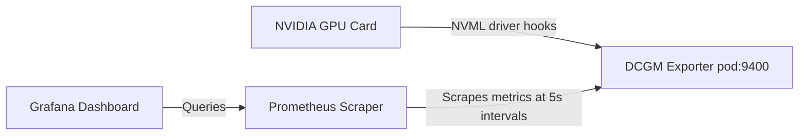

# Lab 5: DCGM Observability Pipeline

## Objective
Establish a telemetry monitoring pipeline. Deploy the DCGM Exporter to extract low-level hardware metrics, configure Prometheus scrapers with 5s collection intervals, and expose performance dashboards in Grafana.

---

## Architecture Topology



---

## Configuration Reference

### Exporter Service Monitor Configuration (`02-platform/monitoring/prometheus-grafana.yaml`)
```yaml
apiVersion: monitoring.coreos.com/v1
kind: ServiceMonitor
metadata:
  name: dcgm-exporter
  namespace: monitoring
spec:
  selector:
    matchLabels:
      app.kubernetes.io/name: nvidia-dcgm-exporter
  endpoints:
    - port: metrics
      interval: 5s
```

---

## Execution Commands

*   **Purpose:** Deploy the Prometheus and Grafana monitoring stacks.
    *   **Command:**
        ```bash
        kubectl apply -f 02-platform/monitoring/prometheus-grafana.yaml
        ```
    *   **Expected Result:** Monitoring namespaces, deployments, and services initialized.
    *   **Validation:** Verify running pods: `kubectl get pods -n monitoring`

*   **Purpose:** Query the exporter endpoint directly from the node.
    *   **Command:**
        ```bash
        kubectl exec -n gpu-operator ds/nvidia-dcgm-exporter -- curl -s localhost:9400/metrics | grep "dcgm_sm_copy"
        ```
    *   **Expected Result:** Active Prometheus-formatted metrics logs returned.
    *   **Validation:** Confirm lines containing active metric values are present.

*   **Purpose:** Access the Grafana web interface.
    *   **Command:**
        ```bash
        kubectl port-forward svc/grafana-service -n monitoring 3000:3000
        ```
    *   **Expected Result:** Local port mapping active on port 3000.
    *   **Validation:** Navigate to `http://localhost:3000` to verify login prompt.

---

## Verification Steps

*   **Purpose:** Run a workload and monitor SM spikes.
    *   **Command:**
        ```bash
        kubectl apply -f 03-workloads/gpu-test-deployment.yaml
        ```
    *   **Expected Result:** Workload schedules, starts execution, and outputs metrics.
    *   **Validation:** In Grafana, verify the "SM Utilization" panel registers workload spikes.

---

## Cleanup
*   **Purpose:** Uninstall the monitoring stack.
    *   **Command:**
        ```bash
        kubectl delete -f 02-platform/monitoring/prometheus-grafana.yaml
        ```
    *   **Expected Result:** Telemetry services terminated.
    *   **Validation:** Confirm namespace removal: `kubectl get ns monitoring`

---

> [!NOTE] Production Note: High-Resolution Scraping
> GPU workloads execute in transient bursts. CPU-level metrics (scraped every 30s) miss these spikes. Set the DCGM Exporter scrape interval to 5s to ensure accuracy.

---

## Common Failure Modes
*   **Scraper Port Blockage:** Security group rules block traffic on port 9400. Ensure internal cluster routing permits Prometheus access.
*   **Socket Read Failures:** Exporter crashes if the NVML socket `/var/run/nvidia-topologyd` becomes unresponsive. Restarting the driver container resolves this loop.
*   **Namespace Metric Collisions:** Under GPU Time Slicing, DCGM binds resource metrics to the physical GPU UUID. This can cause pod-level metrics to overlap or report inconsistently.

---

## Related Documentation
*   **Core Systems:** [Architecture Topology](../architecture.md) | [Troubleshooting Runbook](../troubleshooting.md) | [Performance Profiling](../performance.md)
*   **Detailed Labs:** [01: Provisioning](01-gpu-node-provisioning.md) | [02: GPU Operator](02-gpu-operator.md) | [03: Device Plugin](03-device-plugin.md) | [04: Time-Slicing](04-time-slicing.md) | [06: Troubleshooting](06-production-troubleshooting.md)
*   **Journal Logs:** [Post-Mortems & Lessons Learned](../lessons-learned.md)
