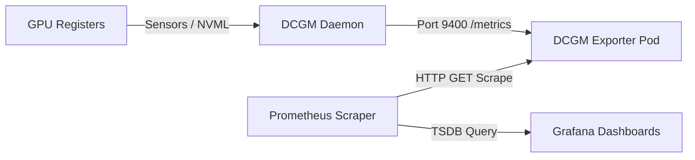

# Lab 5: Hardware Observability & Telemetry with DCGM & Prometheus

## Objective
Establish a high-resolution observability pipeline to scrape hardware-level GPU telemetry. Deploy the DCGM Exporter DaemonSet, scrape device-level performance signals via Prometheus, visualize metrics on Grafana dashboards, and establish operational alert thresholds.

---

## Architecture Topology



---

## Technical Metric Registry

Unlike CPU/Memory metrics which are tracked by the OS, GPU metrics must be scraped from the GPU's internal microcontrollers using the Data Center GPU Manager (DCGM) engine.

| Metric | Name | Interpretation | Warning Alert | Critical Alert |
|---|---|---|---|---|
| **SM Occupancy** | `DCGM_FI_DEV_GPU_UTIL` | Streaming Multiprocessor compute units busy state (%) | < 10% (Idle Node) | N/A |
| **VRAM Consumption** | `DCGM_FI_DEV_FB_USED` | Frame Buffer (VRAM) size currently in use (MB) | > 85% VRAM Load | > 95% (OOM Danger) |
| **Electrical Draw** | `DCGM_FI_DEV_POWER_USAGE` | Real-time electrical consumption (Watts) | N/A | > TDP Max Cap |
| **Temperature** | `DCGM_FI_DEV_GPU_TEMP` | GPU core temperature (Celsius) | > 80°C | > 85°C (Throttling) |
| **SM Clock Rate** | `DCGM_FI_DEV_SM_CLOCK` | Current execution clock speed (MHz) | N/A | Throttling Drop |

---

## Execution Commands

### 1. Deploy the Monitoring Stack (Prometheus & Grafana)
Deploy the local observability instances:
```bash
kubectl apply -f 02-platform/monitoring/prometheus-grafana.yaml
```

### 2. Verify DCGM Service Discovery
Confirm that the DCGM Exporter service exposes the metrics port:
```bash
kubectl get svc -n gpu-operator -l app.kubernetes.io/name=nvidia-dcgm-exporter
```

### 3. Fetch Raw Exporter Telemetry
Run a validation curl check against the metrics endpoint from inside the cluster:
```bash
kubectl run curl-monitor --image=curlimages/curl -i --rm --restart=Never -- \
  curl -s http://nvidia-dcgm-exporter.gpu-operator.svc.cluster.local:9400/metrics | grep DCGM_
```

---

## Expected Output
A stream of Prometheus metric lines:
```text
# HELP DCGM_FI_DEV_GPU_UTIL GPU Utilization (in %).
# TYPE DCGM_FI_DEV_GPU_UTIL gauge
DCGM_FI_DEV_GPU_UTIL{gpu="0", UUID="GPU-70e2...",device="nvidia0",modelName="Tesla T4",container="cuda-test",namespace="default",pod="gpu-test-pod"} 92
# HELP DCGM_FI_DEV_FB_USED Framebuffer memory used (in MiB).
# TYPE DCGM_FI_DEV_FB_USED gauge
DCGM_FI_DEV_FB_USED{gpu="0", UUID="GPU-70e2...",device="nvidia0",modelName="Tesla T4",container="cuda-test",namespace="default",pod="gpu-test-pod"} 4210
```

---

## Verification Steps

### 1. View Prometheus Targets
Check if Prometheus successfully discovers and scrapes the exporter:
```bash
# Port forward Prometheus UI
kubectl port-forward svc/prometheus-service 9090:9090 &
```
Browse to `http://localhost:9090/targets` and confirm that `dcgm-exporter` is listed as `UP`.

### 2. Verify Grafana Visualizations
```bash
# Port forward Grafana UI
kubectl port-forward svc/grafana-service 3000:3000 &
```
Browse to `http://localhost:3000` (Access credentials: `admin / admin`). Open the GPU Dashboard and verify graphs populate for SM Load and Temp.

---

## Cleanup
Terminate the background port-forwarding processes:
```bash
kill $(jobs -p)
```

---

> [!NOTE] Engineering Note: DCGM Metric Resolution
> DCGM measures hardware registers directly, not Kubernetes scheduling decisions. If you use GPU Time-Slicing, DCGM metrics like `DCGM_FI_DEV_GPU_UTIL` and `DCGM_FI_DEV_GPU_TEMP` remain device-wide. You cannot calculate independent per-pod GPU utilization because the hardware SM engine does not distinguish container namespaces.

---

## Interview Takeaways

*   **ホワイトボード: Discussing Production Alerting Rules:**
    *   Explain how to configure alerting on thermal or clock violations. If `dcgm_clock_throttle_reasons` matches a bitmask for thermal throttling (indicating the clock dropped to cool the card), it represents an infrastructure cooling failure.
*   **XID Error Code Monitoring:** Discuss that scraping `dcgm_xid_errors` is the most critical alerting signal. Any value greater than 0 represents a driver/hardware crash. For instance, XID 31 indicates memory page faults, while XID 45 indicates a PCIe link loss which takes the node down.
*   **Scrape Interval Trade-offs:** Explain that GPU workloads scale rapidly. Standard 30s scrape intervals smooth out transient GPU load spikes, making it look underutilized. For machine learning models, scrape intervals should be reduced to 5 seconds to capture peak load events.
